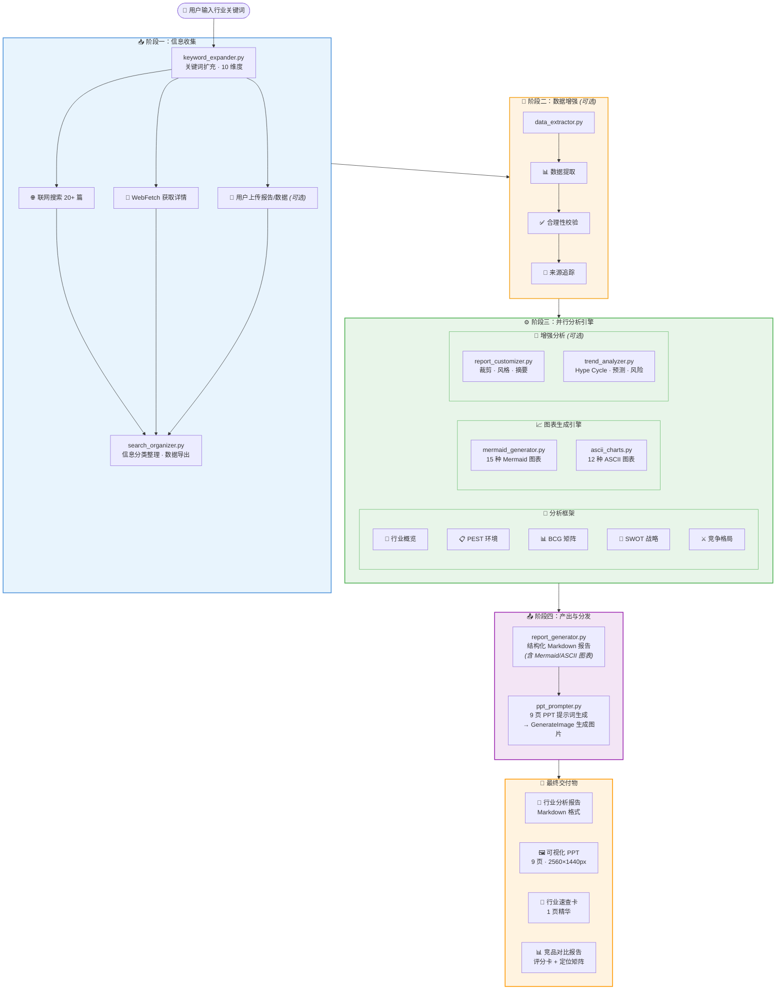

# industry-analysis

🚀 **一句话触发，自动完成全流程行业分析：从联网搜索到结构化报告，再到可视化 PPT 一键生成。**

基于 AI Agent 的行业分析技能，覆盖 PEST、BCG、SWOT 等经典分析框架，内置 11 个 Python 脚本工具，输出带 Mermaid/ASCII 图表的专业 Markdown 报告与 9 页高颜值 PPT。支持速查、完整、精简、汇报、竞品、趋势六大模式，满足从快速背调到深度研究的所有场景。

<p align="center">
  
  
  
</p>

## 🌟 它解决什么问题？

在研究一个行业时，传统工作流极其低效：

1. **信息收集耗时**：手动搜索、逐个打开网页，在海量信息中辨别真伪，往往需要数小时才能收集到足够资料。
2. **分析不成体系**：大多数人缺乏结构化的分析框架，看到的数据堆在一起，无法形成清晰的洞察和结论。
3. **图表制作重复劳动**：好不容易写完报告，还得重新构思 PPT、手动画图，数据稍有变动就要重来一遍。
4. **报告质量参差不齐**：每个人写出来的报告格式、深度差异巨大，难以标准化。

本 Skill 旨在打造一个 **全自动、高质量、多模式** 的行业分析引擎：

- **自动搜索与提炼**：智能扩充关键词，联网抓取 20+ 篇行业资料，自动分类整理。
- **经典分析框架驱动**：内置 PEST、BCG、SWOT、波特五力等专业框架，拒绝"拍脑袋"分析。
- **图文并茂自动输出**：Mermaid/ASCII 图表自动穿插在报告中，9 页 PPT 一键生成。
- **多模式按需选择**：从 1 分钟速查卡到 10 分钟完整报告，覆盖所有场景。

## 🧭 Before / After

| 维度         | ❌ 传统方式               | ✅ 本 Skill                              |
| ---------- | -------------------- | -------------------------------------- |
| **信息收集**   | 手动搜索 2-4 小时，逐个打开网页   | 一句话触发，自动扩充关键词并联网搜索 20+ 篇资料             |
| **分析框架**   | 凭经验"拍脑袋"，缺少结构化方法论    | 内置 PEST / BCG / SWOT / 波特五力等经典框架       |
| **报告撰写**   | 格式不统一，图表需要手动设计插入     | 自动生成带 Mermaid/ASCII 图表的标准化 Markdown 报告 |
| **PPT 制作** | 重复劳动，报告和 PPT 数据可能不一致 | 基于同一份数据源，9 页 PPT 一键生成，信息对齐             |
| **深度定制**   | 想调整分析角度几乎等于重写        | 6 种输出模式 + 3 种写作风格 + 5 种报告类型，按需组合       |
| **数据质量**   | 数据来源不清，可信度存疑         | 自动数据校验 + 来源追踪，异常值标记提醒                  |
| **时间成本**   | 通常半天到一天              | 速查模式 1 分钟，完整报告 10 分钟                   |

## 🚀 快速上手

### 1. 环境准备

- 确保已安装 Python 3.7+
- 所有脚本均零外部依赖，无需 `pip install`

### 2. 使用方式

将本项目克隆到本地后，使用支持 Skill 机制的 AI Agent 平台（如 Trae），直接对话即可：

**一句话触发：**

> "请帮我详细分析新能源汽车行业"

Agent 会自动读取 `SKILL.md`，理解完整工作流并执行。

### 3. 模式选择

根据需求选择不同的输出模式：

| 模式       | 触发方式           | 输出内容           | 预计用时    |
| -------- | -------------- | -------------- | ------- |
| **速查模式** | "快速了解 XX 行业"   | 1 页行业速查卡       | \~1 分钟  |
| **完整模式** | "详细分析 XX 行业"   | 完整报告 + 9 页 PPT | \~10 分钟 |
| **精简模式** | "简要分析 XX 行业"   | 精简版报告          | \~5 分钟  |
| **汇报模式** | "XX 行业汇报材料"    | 执行摘要 + 核心洞察    | \~3 分钟  |
| **竞品模式** | "分析 XX 行业竞争格局" | 竞品对比报告         | \~5 分钟  |
| **趋势模式** | "XX 行业趋势预测"    | 趋势洞察 + 时机评估    | \~5 分钟  |

### 4. 示例对话

```
用户：请帮我详细分析人工智能行业
Agent：好的，我将为您生成完整的人工智能行业分析报告...
       [自动执行: 关键词扩充 → 联网搜索 20+ 篇 → PEST分析 → BCG矩阵 → SWOT分析 → 生成报告 → 生成PPT]
```

## 🤖 AI Agent 自动完成的流程

```
用户输入行业关键词
       ↓
  关键词扩充与搜索 (keyword_expander.py)
       联网搜索 20+ 篇行业资料
       ↓
  搜索结果分类整理 (search_organizer.py)
       ↓
  行业概览分析 → PEST环境分析 → BCG矩阵分析 → SWOT战略分析
       ↓
  生成结构化 Markdown 报告 (report_generator.py)
       ├── 穿插 Mermaid/ASCII 图表 (mermaid_generator.py / ascii_charts.py)
       ↓
  生成 9 页可视化 PPT (ppt_prompter.py)
```

### 可选的增强流程

```
用户上传行业报告/数据
       ↓
  数据提取与校验 (data_extractor.py → extract → validate → track)
       ↓
  定制化报告输出 (report_customizer.py)
       ├── 裁剪模块 (trim)
       ├── 风格转换 (style)
       ├── 执行摘要 (summary)
       └── 核心洞察 (insights)
       ↓
  趋势深度洞察 (trend_analyzer.py)
       ├── Hype Cycle 技术成熟度
       ├── 趋势预测
       ├── 进入时机矩阵
       └── 风险预警清单
```

## 🧩 核心功能矩阵

### 六大分析框架

| 框架          | 说明                              | 输出              |
| ----------- | ------------------------------- | --------------- |
| **行业概览**    | 定义、规模、阶段、痛点、商业模式、产业链            | 结构化描述 + 数据表格    |
| **PEST 分析** | 政治法规、经济环境、社会文化、技术环境             | 思维导图 + 四维度详解    |
| **BCG 矩阵**  | 明星、现金牛、问题、瘦狗四象限                 | 象限图 + 战略建议      |
| **SWOT 分析** | 优势、劣势、机会、威胁 + 交叉策略（SO/WO/ST/WT） | 矩阵图 + 综合战略建议    |
| **竞品分析**    | 8 维度能力评分、定位矩阵、SWOT 对比、差异化分析     | 评分卡 + 定位图 + 对比表 |
| **趋势洞察**    | Hype Cycle、趋势预测、时机评估、风险预警       | 成熟度曲线 + 风险清单    |

### 八大增强模块

| 模块       | 脚本                     | 核心能力                          |
| -------- | ---------------------- | ----------------------------- |
| 关键词扩充    | `keyword_expander.py`  | 10 维度自动扩展搜索词                  |
| 搜索整理     | `search_organizer.py`  | 10 分类维度自动归档                   |
| 图表生成     | `mermaid_generator.py` | 15 种 Mermaid 图表 + ASCII 降级方案  |
| ASCII 图表 | `ascii_charts.py`      | 12 种 ASCII 艺术图表，跨平台兼容         |
| 数据增强     | `data_extractor.py`    | 7 类关键数据提取 + 合理性校验 + 来源追踪      |
| 报告定制     | `report_customizer.py` | 5 种报告类型 + 3 种写作风格 + 摘要/洞察提取   |
| 趋势洞察     | `trend_analyzer.py`    | Hype Cycle 阶段判断 + 时机矩阵 + 风险预警 |
| PPT 生成   | `ppt_prompter.py`      | 9 页 PPT 页面提示词生成               |

## 🏗️ 架构与技术栈



**技术栈：**

| 层级 | 技术选型 | 说明 |
|------|----------|------|
| 语言 | Python 3.7+ | 全部 11 个脚本，零外部依赖 |
| 图表引擎 | Mermaid + ASCII Art | Mermaid 用于文档/GitHub 渲染；ASCII Art 兼容终端/邮件/即时通讯 |
| 分析框架 | PEST · BCG · SWOT · 波特五力 · Hype Cycle · 定位矩阵 | 覆盖宏观环境、业务组合、竞争战略、技术成熟度 |
| 运行方式 | AI Agent + SKILL.md | Agent 读取 SKILL.md 编排全流程，脚本作为原子工具被调用 |
| PPT 生成 | Image Generation API | 由 ppt_prompter.py 生成结构化提示词，调用图像生成接口产出 9 页 PPT |

## 📂 项目结构

```
industry-analysis/
├── SKILL.md                           # 技能定义文件 (Agent 入口)
├── README.md                          # 项目说明 (本文件)
├── 使用说明.md                         # 中文详细使用说明
│
├── scripts/                           # 核心脚本工具 (11个)
│   ├── keyword_expander.py            # 关键词扩充器
│   ├── search_organizer.py            # 搜索结果整理器
│   ├── report_generator.py            # 分析报告生成器
│   ├── ppt_prompter.py                # PPT 提示词生成器
│   ├── mermaid_generator.py           # Mermaid 图表生成器
│   ├── ascii_charts.py                # ASCII 图表生成器
│   ├── quick_card_generator.py        # 行业速查卡生成器
│   ├── competitor_matrix.py           # 竞品分析矩阵
│   ├── data_extractor.py              # 数据增强模块
│   ├── report_customizer.py           # 报告定制化模块
│   └── trend_analyzer.py              # 趋势洞察分析模块
│
├── references/                        # 参考文档 (9篇)
│   ├── analysis-frameworks.md         # PEST/BCG/SWOT 框架详解
│   ├── report-template.md             # 完整报告模板
│   ├── ppt-template.md                # PPT 模板与设计规范
│   ├── quick-card-template.md         # 行业速查卡模板
│   ├── competitor-analysis.md         # 竞品分析框架
│   ├── ascii-charts-guide.md          # ASCII 图表使用指南
│   ├── data-enhancement-guide.md      # 数据增强模块指南
│   ├── report-customization-guide.md  # 报告定制化指南
│   └── trend-insight-guide.md         # 趋势洞察分析指南
│
└── output/                            # 输出示例
    ├── report.md                      # 示例分析报告 (新能源汽车)
    └── ppt_prompts.md                 # 示例 PPT 提示词
```

## 📊 输出成果展示

### 行业分析报告

完整报告包含六大章节，图表自动穿插：

| 章节          | 内容                        |
| ----------- | ------------------------- |
| 一、行业概览      | 行业定义、基本数据、痛点、商业模式、产业链位置   |
| 二、PEST 环境分析 | 政治法规、经济环境、社会文化、技术环境四维度    |
| 三、BCG 矩阵分析  | 四象限市场定位 + 战略建议            |
| 四、SWOT 战略分析 | SO/WO/ST/WT 交叉策略 + 综合战略建议 |
| 五、竞争格局      | 市场份额、头部企业、竞争态势            |
| 六、总结与建议     | 关键洞察、战略建议、风险提示            |

### 可视化图表 (自动生成)

| 图表类型      | 用途        | 格式                            |
| --------- | --------- | ----------------------------- |
| 产业链图      | 上中下游关系可视化 | Mermaid flowchart / ASCII     |
| PEST 思维导图 | 宏观环境因素概览  | Mermaid mindmap / ASCII       |
| BCG 象限图   | 业务组合分析    | Mermaid quadrantChart / ASCII |
| SWOT 矩阵   | 四维度战略分析   | Mermaid mindmap / ASCII       |
| 市场份额饼图    | 竞争格局      | Mermaid pie / ASCII           |
| 增长趋势图     | 市场规模变化    | Mermaid xychart-beta / ASCII  |
| 波特五力图     | 行业竞争力量分析  | Mermaid flowchart             |
| 竞品评分卡     | 8 维度能力评估  | ASCII score card              |
| 定位矩阵图     | 价格-品质定位对比 | Mermaid quadrantChart         |

### 9 页可视化 PPT

| 页码 | 内容      | 规格            |
| -- | ------- | ------------- |
| P1 | 封面页     | 标题 + 副标题 + 日期 |
| P2 | 行业概览    | 核心数据展示        |
| P3 | 市场规模与增长 | 数据可视化         |
| P4 | 产业链分析   | 流程图形式         |
| P5 | PEST 分析 | 四象限布局         |
| P6 | BCG 矩阵  | 矩阵图形式         |
| P7 | SWOT 分析 | 四象限布局         |
| P8 | 关键洞察与建议 | 要点列表          |
| P9 | 结尾页     | 感谢语           |

**视觉风格**：线性扁平，浅蓝灰色调，工程图纸网格背景，极简几何线条装饰，留白充足。

## 🔧 脚本工具详情

### 核心分析脚本

| 脚本                    | 功能         | 输入            | 输出                  |
| --------------------- | ---------- | ------------- | ------------------- |
| `keyword_expander.py` | 10 维度关键词扩充 | 行业名称          | Markdown/JSON 搜索词列表 |
| `search_organizer.py` | 搜索结果分类归档   | 行业名称          | 分类摘要/JSON/Markdown  |
| `report_generator.py` | 结构化报告生成    | 行业名 + 数据 JSON | 完整 Markdown 报告      |
| `ppt_prompter.py`     | PPT 页面提示词  | 行业名 + 数据 JSON | 9 页 PPT 提示词/JSON 配置 |

### 可视化脚本

| 脚本                     | 支持类型                                                                           | 图表数量 |
| ---------------------- | ------------------------------------------------------------------------------ | ---- |
| `mermaid_generator.py` | flowchart, mindmap, quadrantChart, pie, xychart-beta, timeline, gantt, journey | 15 种 |
| `ascii_charts.py`      | bar, pie, trend, quadrant, flow, table, swot, bcg, pest, chain, score          | 12 种 |

### 专题脚本

| 脚本                        | 核心输出                           |
| ------------------------- | ------------------------------ |
| `quick_card_generator.py` | 1 页行业速查卡 (ASCII/Markdown/JSON) |
| `competitor_matrix.py`    | 竞品对比表 + 定位分析 + SWOT 对比 + 差异化策略 |

### 增强脚本

| 脚本                     | 命令                                                   | 功能                   |
| ---------------------- | ---------------------------------------------------- | -------------------- |
| `data_extractor.py`    | `extract` / `validate` / `track`                     | 数据提取、合理性校验、来源追踪      |
| `report_customizer.py` | `config` / `trim` / `style` / `summary` / `insights` | 报告裁剪、风格转换、摘要、洞察      |
| `trend_analyzer.py`    | `hype` / `predict` / `timing` / `risk`               | 技术成熟度、趋势预测、时机评估、风险预警 |

## 📈 适用场景

| 场景          | 推荐配置                  | 输出组合                     |
| ----------- | --------------------- | ------------------------ |
| 🏢 向 CEO 汇报 | 汇报模式 + 正式风格 + PPT     | 执行摘要 + 核心洞察 + 9 页 PPT    |
| 💰 投资决策     | 完整模式 + 数据驱动风格 + 趋势洞察  | 完整报告 + Hype Cycle + 时机评估 |
| 👥 团队内部分享   | 精简模式 + 简洁风格           | 精简报告 + 核心图表              |
| ⚔️ 竞争分析会议   | 竞品模式 + 数据驱动风格         | 竞品对比报告 + 定位矩阵            |
| ⚡ 快速背调      | 速查模式                  | 1 页行业速查卡                 |
| 🎯 战略规划     | 完整模式 + SWOT 专题 + 时机评估 | 完整报告 + 交叉策略 + 风险预警       |

## 🛠️ 独立使用脚本

除了通过 AI Agent 编排执行，所有脚本也可以独立运行：

```bash
# 1. 关键词扩充
python scripts/keyword_expander.py "新能源汽车"

# 2. 生成 Mermaid 图表
python scripts/mermaid_generator.py pie '{"companies":[{"name":"比亚迪","share":35},{"name":"特斯拉","share":18}]}'

# 3. 生成 ASCII 图表 (跨平台兼容)
python scripts/ascii_charts.py swot '{"strengths":["产业链完整"],"weaknesses":["品牌溢价低"],"opportunities":["海外市场"],"threats":["贸易壁垒"]}'

# 4. 生成行业速查卡
python scripts/quick_card_generator.py "新能源汽车" --format=markdown

# 5. 生成竞品分析
python scripts/competitor_matrix.py "新能源汽车" competitors.json
```

## 🤝 贡献与参与

我们非常欢迎来自社区的贡献！无论是发现 Bug、提供新想法，还是提交 PR 来改进这个 Skill，我们都非常期待。

1. Fork 本仓库
2. 创建你的特性分支 (`git checkout -b feature/AmazingFeature`)
3. 提交你的更改 (`git commit -m 'Add some AmazingFeature'`)
4. 推送至分支 (`git push origin feature/AmazingFeature`)
5. 发起一个 Pull Request

## 📜 许可证

本项目采用 [MIT License](LICENSE) 开源协议。你可以自由地使用、修改和分发本项目，只需保留原作者的版权声明。

## ⚠️ 免责声明

1. **数据时效性**：本 Skill 依赖联网搜索获取数据，数据的准确性和时效性取决于搜索源的质量。报告中会标注数据来源和可信度，建议对关键数据进行交叉验证。
2. **AI 生成内容**：分析框架提供结构化的思考方式，但具体分析结论由 AI 基于搜索结果生成，可能存在偏差或不准确的情况，使用者需结合自身专业判断进行审阅。
3. **图表兼容性**：Mermaid 图表依赖目标平台的渲染支持。如果渲染不正常，可切换到 ASCII 模式以获得更广泛的兼容性。

## 📝 更新日志

| 版本   | 更新内容                                      |
| ---- | ----------------------------------------- |
| v1.0 | 基础分析功能：关键词扩充、PEST/BCG/SWOT 分析、报告生成、PPT 生成 |
| v1.1 | 新增行业速查卡、竞品分析模块                            |
| v1.2 | 新增 ASCII 图表支持，提升跨平台兼容性                    |
| v2.0 | 新增数据增强模块（数据提取、校验、来源追踪）                    |
| v2.1 | 新增报告定制化模块（裁剪、风格转换、摘要、洞察提取）                |
| v2.2 | 新增趋势洞察模块（Hype Cycle、趋势预测、时机矩阵、风险预警）       |

