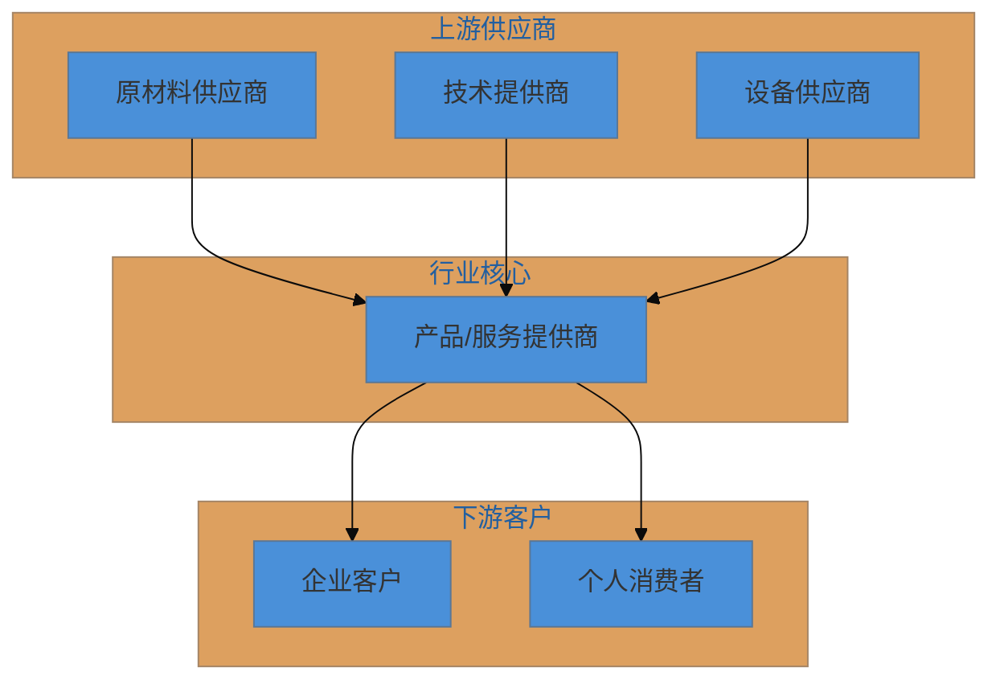

# 行业分析技能

根据用户提供的行业关键词，自动完成全流程行业分析，输出专业的行业分析报告和可视化PPT。

## 技能模式

本技能支持多种输出模式，根据用户需求选择：

| 模式 | 输出内容 | 适用场景 | 用时 |
|------|----------|----------|------|
| **速查模式** | 1页行业速查卡 | 快速了解、会前准备、背调 | 1分钟 |
| **完整模式** | 完整分析报告+PPT | 深度研究、汇报材料 | 10分钟 |
| **精简模式** | 精简版报告 | 快速决策、内部沟通 | 5分钟 |
| **汇报模式** | 执行摘要+核心洞察 | 高层汇报、决策参考 | 3分钟 |
| **竞品模式** | 竞品对比分析报告 | 竞争分析、策略制定 | 5分钟 |
| **趋势模式** | 趋势洞察+时机评估 | 战略规划、投资决策 | 5分钟 |

## 增强功能

### 数据增强模块

支持用户上传行业报告/数据，自动提取关键数据点：

| 功能 | 说明 |
|------|------|
| 数据提取 | 从文本中提取市场规模、增长率等关键数据 |
| 数据校验 | 检查数据合理性，标记异常值 |
| 来源追踪 | 自动标注数据来源，生成引用列表 |

```bash
# 从用户上传的报告中提取数据
python scripts/data_extractor.py extract uploaded_report.txt

# 校验提取的数据
python scripts/data_extractor.py validate extracted_data.json

# 生成来源追踪
python scripts/data_extractor.py track sources.json
```

### 报告定制化模块

支持按需定制报告类型、模块和风格：

| 报告类型 | 包含模块 | 适用场景 |
|----------|----------|----------|
| 完整版 | 全部6个模块 | 深度研究 |
| 精简版 | 概览+SWOT+竞争 | 快速了解 |
| 汇报版 | 概览+SWOT | 高层汇报 |
| PEST专题 | 概览+PEST | 宏观分析 |
| 竞争专题 | 概览+竞争+BCG | 竞争分析 |

| 输出风格 | 特点 | 适用场景 |
|----------|------|----------|
| 正式风格 | 专业、严谨、客观 | 正式报告 |
| 简洁风格 | 直接、清晰、高效 | 内部沟通 |
| 数据驱动 | 量化、精确、证据导向 | 投资决策 |

```bash
# 查看定制选项
python scripts/report_customizer.py config

# 生成精简版报告
python scripts/report_customizer.py trim brief full_report.md

# 获取风格指南
python scripts/report_customizer.py style data_driven

# 生成执行摘要
python scripts/report_customizer.py summary data.json "行业名称"

# 提取核心洞察
python scripts/report_customizer.py insights report.md
```

### 趋势洞察模块

提供前瞻性分析能力：

| 功能 | 说明 |
|------|------|
| Hype Cycle | 技术成熟度曲线分析 |
| 趋势预测 | 技术/市场/政策三维度预测 |
| 时机矩阵 | 进入时机评估 |
| 风险预警 | 风险清单和预警机制 |

```bash
# 生成Hype Cycle分析
python scripts/trend_analyzer.py hype techs.json

# 生成趋势预测模板
python scripts/trend_analyzer.py predict "新能源汽车"

# 进入时机评估
python scripts/trend_analyzer.py timing "新能源汽车" assessment.json

# 风险预警清单
python scripts/trend_analyzer.py risk "新能源汽车" risks.json
```

## 工作流程概览

### 完整模式流程

```
用户输入行业关键词
       ↓
  关键词扩充与搜索
       ↓
  行业概览分析
       ↓
  PEST环境分析
       ↓
  BCG矩阵分析
       ↓
  SWOT战略分析
       ↓
  生成分析报告(含mermaid图表)
       ↓
  生成可视化PPT
```

### 速查模式流程

```
用户输入行业关键词
       ↓
  快速信息收集
       ↓
  提取核心数据
       ↓
  生成行业速查卡
```

### 竞品模式流程

```
用户输入行业关键词 + 竞品列表
       ↓
  竞品信息收集
       ↓
  能力评分对比
       ↓
  定位分析
       ↓
  SWOT对比
       ↓
  竞争策略建议
```

---

## 快速模式：行业速查卡

当用户只需要快速了解一个行业时，使用速查模式生成1页精华的行业速查卡。

### 速查卡内容

| 模块 | 内容 |
|------|------|
| 核心数据 | 市场规模、增长率、发展阶段、渗透率 |
| 头部玩家 | TOP3-5企业及市场份额 |
| 核心驱动 | 推动行业增长的3个主要因素 |
| 主要风险 | 行业面临的3个主要风险 |
| 趋势判断 | 看多/看平/看空 + 一句话建议 |

### 速查卡生成

```bash
# ASCII格式（终端显示）
python scripts/quick_card_generator.py "行业名称"

# Markdown格式
python scripts/quick_card_generator.py "行业名称" --format=markdown

# 使用数据文件
python scripts/quick_card_generator.py "行业名称" data.json --format=markdown
```

### 速查卡输出示例

```
╔══════════════════════════════════════════════════════════════════╗
║                 🔍 新能源汽车行业速查卡                           
╠══════════════════════════════════════════════════════════════════╣
║  ┌─────────────────┬─────────────────────────────────────────┐  ║
║  │ 📊 市场规模     │ 3.2万亿元                               │  ║
║  │ 📈 增长率       │ 35%                                     │  ║
║  │ 🚀 发展阶段     │ 快速成长期                              │  ║
║  │ 📍 渗透率       │ 38%                                     │  ║
║  └─────────────────┴─────────────────────────────────────────┘  ║
╠══════════════════════════════════════════════════════════════════╣
║  🏆 头部玩家                                                     ║
║  比亚迪(35%) > 特斯拉(18%) > 理想(12%)                           ║
╠══════════════════════════════════════════════════════════════════╣
║  ✅ 核心驱动: 政策补贴 + 电池降本 + 消费升级                     ║
║  ⚠️ 主要风险: 补贴退坡 + 产能过剩 + 原材料波动                   ║
╠══════════════════════════════════════════════════════════════════╣
║  📈 趋势判断: 看多     │ 💡 关注智能化+出海赛道                  ║
╚══════════════════════════════════════════════════════════════════╝
```

详细模板参见 [references/quick-card-template.md](references/quick-card-template.md)

---

## 竞品模式：竞品分析报告

当用户需要进行竞品对比分析时，使用竞品模式。

### 输入要求

- 行业关键词
- 3-5个竞品公司名称

### 输出内容

| 模块 | 内容 |
|------|------|
| 基本信息对比 | 成立时间、融资、估值、规模、核心业务 |
| 产品对比 | 主要产品、定价、目标客户、核心卖点 |
| 能力评分 | 8个维度的星级评分对比 |
| 定位分析 | 价格-品质定位矩阵图 |
| SWOT对比 | 各竞品的SWOT分析 |
| 差异化分析 | 各竞品的差异化策略 |
| 竞争策略 | 针对各竞品的应对建议 |

### 竞品分析生成

```bash
# 生成完整竞品分析报告
python scripts/competitor_matrix.py "行业名称" competitors.json

# 仅生成对比表格
python scripts/competitor_matrix.py "行业名称" competitors.json --output=table

# 仅生成定位分析
python scripts/competitor_matrix.py "行业名称" competitors.json --output=positioning

# 仅生成SWOT对比
python scripts/competitor_matrix.py "行业名称" competitors.json --output=swot
```

### 竞品数据JSON格式

```json
{
  "competitors": [
    {
      "name": "竞品A",
      "info": {
        "founded": "2015年",
        "funding": "D轮",
        "valuation": "100亿",
        "employees": "5000人",
        "core_business": "核心业务描述"
      },
      "product": {
        "main_product": "主要产品",
        "price_range": "价格区间",
        "target_customer": "目标客户",
        "usp": "核心卖点"
      },
      "scores": {
        "产品力": 5,
        "技术实力": 4,
        "品牌影响力": 4,
        "渠道能力": 3,
        "价格竞争力": 4,
        "服务质量": 4,
        "市场份额": 5,
        "增长势头": 5
      },
      "positioning": {"price": 0.6, "quality": 0.8},
      "swot": {
        "strengths": ["优势1", "优势2"],
        "weaknesses": ["劣势1", "劣势2"],
        "opportunities": ["机会1", "机会2"],
        "threats": ["威胁1", "威胁2"]
      }
    }
  ]
}
```

详细框架参见 [references/competitor-analysis.md](references/competitor-analysis.md)

---

## 完整模式：行业分析报告

## 阶段一：关键词扩充与信息收集

### 1.1 关键词扩充

收到用户的行业关键词后，使用关键词扩充脚本生成搜索关键词：

```bash
python scripts/keyword_expander.py "行业名称"
# 或输出JSON格式
python scripts/keyword_expander.py "行业名称" --json
```

脚本自动按以下维度扩充关键词：
1. **核心概念扩展**：行业定义、行业分类、行业边界
2. **产业链扩展**：上游供应商、下游客户、产业链位置
3. **竞争维度扩展**：主要玩家、市场份额、竞争格局
4. **技术维度扩展**：核心技术、技术趋势、技术壁垒
5. **市场维度扩展**：市场规模、增长率、区域分布
6. **政策维度扩展**：相关政策、监管要求、行业标准

### 1.2 联网搜索策略

使用WebSearch工具进行搜索，搜索20篇左右的文章。脚本会生成优先级排序的搜索查询列表。

对于重要的搜索结果，使用WebFetch工具获取详细内容。

### 1.3 搜索结果整理

使用搜索结果整理脚本对收集的信息进行分类：

```bash
# 输出摘要
python scripts/search_organizer.py "行业名称" summary

# 导出分析数据JSON
python scripts/search_organizer.py "行业名称" export

# 输出Markdown格式
python scripts/search_organizer.py "行业名称" markdown
```

### 1.4 信息整理原则

- 优先使用权威来源（行业报告、官方数据、头部研究机构）
- 标注数据来源和时间
- 区分事实数据与分析观点
- 保持信息的时效性（优先使用近1-2年数据）

## 阶段二：行业概览分析

输出以下五个维度的分析：

### 2.1 行业概况

- 行业定义与边界
- 行业发展历程
- 行业当前发展阶段
- 行业核心特征

### 2.2 行业基本数据

- 市场规模（全球/中国）
- 增长率（历史/预测）
- 主要细分市场占比
- 区域分布特征

### 2.3 行业痛点

- 技术层面痛点
- 商业层面痛点
- 用户层面痛点
- 监管层面痛点

### 2.4 行业商业模式

- 主流商业模式类型
- 盈利模式分析
- 价值链分析
- 成本结构分析

### 2.5 产业链位置

- 上游供应商分析
- 下游客户分析
- 产业链价值分布
- 关键环节识别

## 阶段三：PEST环境分析

详细分析框架参见 [references/analysis-frameworks.md](references/analysis-frameworks.md)

### 3.1 Political（政治法规）

仅关注政策法规相关内容：
- 行业相关法律法规
- 政府支持政策
- 监管要求与合规
- 行业标准与规范

### 3.2 Economic（经济环境）

重点关注居民消费相关指标：
- 宏观经济环境
- 居民消费能力
- 消费结构变化
- 行业投融资情况

### 3.3 Social（社会文化）

重点关注消费观念、消费习惯：
- 人口结构变化
- 消费观念演变
- 生活方式变化
- 社会价值观影响

### 3.4 Technological（技术环境）

重点关注媒介、网络、内容产业相关技术创新：
- 核心技术发展
- 技术创新趋势
- 数字化转型
- 新兴技术应用

## 阶段四：BCG矩阵分析

### 4.1 分析维度

- **市场增长率**：行业整体增长速度
- **相对市场份额**：主要企业市场地位

### 4.2 四象限分类

- **明星业务**：高增长、高份额
- **现金牛业务**：低增长、高份额
- **问题业务**：高增长、低份额
- **瘦狗业务**：低增长、低份额

### 4.3 输出内容

- 主要企业/业务的BCG矩阵定位
- 各象限的战略建议
- 使用mermaid绘制BCG矩阵图

## 阶段五：SWOT战略分析

详细分析框架参见 [references/analysis-frameworks.md](references/analysis-frameworks.md)

### 5.1 四维度分析

1. **Strengths（优势）**：内部优势因素
2. **Weaknesses（劣势）**：内部劣势因素
3. **Opportunities（机会）**：外部机会因素
4. **Threats（威胁）**：外部威胁因素

### 5.2 交叉策略分析

按以下顺序逐步完成：

1. **SO策略**：优势+机会 → 进攻型策略
2. **WO策略**：劣势+机会 → 改进型策略
3. **ST策略**：优势+威胁 → 防御型策略
4. **WT策略**：劣势+威胁 → 收缩型策略
5. **综合战略建议**：汇总以上分析

### 5.3 输出格式

```markdown
# 优势-机会 (SO) 策略：
- <逐条给出分析结论>
- ……
- <给出这一部分的综合一句话建议>

# 劣势-机会 (WO) 策略：
- <逐条给出分析结论>
- ……
- <给出这一部分的综合一句话建议>

# 优势-风险 (ST) 策略：
- <逐条给出分析结论>
- ……
- <给出这一部分的综合一句话建议>

# 劣势-风险 (WT) 策略：
- <逐条给出分析结论>
- ……
- <给出这一部分的综合一句话建议>

# 综合战略建议：
<给出结合以上分析的整体战略建议>
```

## 阶段六：生成分析报告

### 6.1 报告生成

使用报告生成脚本快速生成结构化报告：

```bash
# 生成模板报告
python scripts/report_generator.py "行业名称"

# 使用数据文件生成报告
python scripts/report_generator.py "行业名称" data.json
```

详细模板参见 [references/report-template.md](references/report-template.md)

```markdown
# [行业名称]行业分析报告

## 一、行业概览
### 1.1 行业概况
### 1.2 行业基本数据
### 1.3 行业痛点
### 1.4 商业模式
### 1.5 产业链位置

## 二、PEST环境分析
### 2.1 政治法规环境
### 2.2 经济环境
### 2.3 社会文化环境
### 2.4 技术环境

## 三、BCG矩阵分析
### 3.1 市场定位分析
### 3.2 战略建议

## 四、SWOT战略分析
### 4.1 优势分析
### 4.2 劣势分析
### 4.3 机会分析
### 4.4 威胁分析
### 4.5 交叉策略分析

## 五、总结与建议
### 5.1 关键洞察
### 5.2 战略建议
### 5.3 风险提示
```

### 6.2 Mermaid图表要求

在报告中穿插以下类型的mermaid图表：

1. **产业链图**：使用flowchart展示上下游关系
2. **PEST分析图**：使用mindmap或quadrantChart
3. **BCG矩阵图**：使用quadrantChart
4. **SWOT分析图**：使用quadrantChart或mindmap
5. **竞争格局图**：使用pie或bar图表

使用Mermaid图表生成脚本快速生成图表：

```bash
# 生成产业链图
python scripts/mermaid_generator.py chain '{"upstream":["供应商A","供应商B"],"midstream":["核心企业"],"downstream":["客户A","客户B"]}'

# 生成PEST思维导图
python scripts/mermaid_generator.py pest

# 生成BCG矩阵
python scripts/mermaid_generator.py bcg '{"companies":[{"name":"企业A","market_share":0.7,"growth_rate":0.8}]}'

# 生成SWOT思维导图
python scripts/mermaid_generator.py swot

# 生成市场份额饼图
python scripts/mermaid_generator.py pie '{"companies":[{"name":"企业A","share":35}]}'

# 生成增长趋势图
python scripts/mermaid_generator.py trend

# 生成波特五力分析
python scripts/mermaid_generator.py porter
```

示例产业链图：



## 阶段七：生成可视化PPT

### 7.1 PPT提示词生成

使用PPT提示词生成脚本生成每页PPT的提示词：

```bash
# 生成每页PPT提示词
python scripts/ppt_prompter.py "行业名称"

# 使用数据文件生成
python scripts/ppt_prompter.py "行业名称" data.json

# 输出PPT JSON配置
python scripts/ppt_prompter.py "行业名称" data.json --json
```

详细模板参见 [references/ppt-template.md](references/ppt-template.md)

### 7.2 PPT结构

使用GenerateImage工具生成每页PPT图片，共9页：

| 页码 | 内容 | 风格要求 |
|------|------|----------|
| 1 | 封面页 | 标题+副标题+日期 |
| 2 | 行业概览 | 核心数据展示 |
| 3 | 市场规模与增长 | 数据可视化 |
| 4 | 产业链分析 | 流程图形式 |
| 5 | PEST分析 | 四象限布局 |
| 6 | BCG矩阵 | 矩阵图形式 |
| 7 | SWOT分析 | 四象限布局 |
| 8 | 关键洞察与建议 | 要点列表 |
| 9 | 结尾页 | 感谢语 |

### 7.3 视觉风格

- 线性扁平风格
- 浅蓝灰色调背景
- 工程图纸网格纹理
- 极简几何线条装饰
- 标题字号小，正文字号更小
- 留白充足
- 不出现人像

### 7.4 PPT生成提示词模板

每页PPT使用以下格式的提示词：

```
生成一张信息图海报。

视觉风格：线性扁平风格，白色工程图纸感的背景，整体呈浅蓝-白色调。
标题的字号小，正文的字号非常小，保持留白充足，适当搭配少量扁平的图解元素。
不要出现人像。

标题「[页面标题]」位于页面左上角，黑色粗体。

[具体内容描述]

底部总结：「[一句话总结]」
```

## 执行检查清单

在执行过程中，按以下清单跟踪进度：

```
任务进度：
- [ ] 阶段一：关键词扩充与信息收集
  - [ ] 关键词扩充完成
  - [ ] 联网搜索完成（20篇左右）
  - [ ] 信息整理完成
- [ ] 阶段二：行业概览分析
  - [ ] 行业概况
  - [ ] 行业基本数据
  - [ ] 行业痛点
  - [ ] 商业模式
  - [ ] 产业链位置
- [ ] 阶段三：PEST环境分析
  - [ ] Political分析
  - [ ] Economic分析
  - [ ] Social分析
  - [ ] Technological分析
- [ ] 阶段四：BCG矩阵分析
- [ ] 阶段五：SWOT战略分析
  - [ ] SO策略
  - [ ] WO策略
  - [ ] ST策略
  - [ ] WT策略
  - [ ] 综合战略建议
- [ ] 阶段六：生成分析报告
  - [ ] 报告文档完成
  - [ ] Mermaid图表插入
- [ ] 阶段七：生成可视化PPT
  - [ ] 9页PPT图片生成
```

## 注意事项

1. **数据时效性**：优先使用2024-2025年的最新数据
2. **来源标注**：重要数据需标注来源
3. **逻辑连贯**：各分析模块之间保持逻辑一致性
4. **图表清晰**：mermaid图表需简洁易读
5. **结论明确**：每个分析模块都要有明确的结论
6. **可操作性**：战略建议需具体可执行

## 图表格式选择

根据目标平台选择合适的图表格式：

| 场景 | 推荐格式 | 生成方式 |
|------|----------|----------|
| GitHub/Markdown文档 | Mermaid | `mermaid_generator.py` |
| 终端/命令行 | ASCII | `ascii_charts.py` |
| 邮件/即时通讯 | ASCII | `ascii_charts.py` |
| 不支持Mermaid的平台 | ASCII | `mermaid_generator.py --ascii` |
| 纯文本报告 | ASCII | `ascii_charts.py` |

### ASCII图表示例

当Mermaid渲染不佳时，使用ASCII格式确保兼容性：

```bash
# 通过mermaid_generator.py使用--ascii选项
python scripts/mermaid_generator.py --ascii swot '{"strengths":["优势1"],"weaknesses":["劣势1"],"opportunities":["机会1"],"threats":["威胁1"]}'

# 直接使用ascii_charts.py
python scripts/ascii_charts.py bcg '{"stars":["明星企业"],"cash_cows":["现金牛"],"question_marks":["问题企业"],"dogs":["瘦狗企业"]}'
```

详细使用指南参见 [ascii-charts-guide.md](references/ascii-charts-guide.md)

## 参考资料索引

| 文档 | 用途 |
|------|------|
| [analysis-frameworks.md](references/analysis-frameworks.md) | PEST/BCG/SWOT等分析框架详解 |
| [report-template.md](references/report-template.md) | 完整分析报告模板 |
| [ppt-template.md](references/ppt-template.md) | PPT生成模板和提示词 |
| [quick-card-template.md](references/quick-card-template.md) | 行业速查卡模板 |
| [competitor-analysis.md](references/competitor-analysis.md) | 竞品分析框架 |
| [ascii-charts-guide.md](references/ascii-charts-guide.md) | ASCII图表使用指南 |
| [data-enhancement-guide.md](references/data-enhancement-guide.md) | 数据增强模块指南 |
| [report-customization-guide.md](references/report-customization-guide.md) | 报告定制化指南 |
| [trend-insight-guide.md](references/trend-insight-guide.md) | 趋势洞察模块指南 |

## 脚本工具索引

### 核心分析脚本

| 脚本 | 功能 |
|------|------|
| `keyword_expander.py` | 关键词扩充 |
| `search_organizer.py` | 搜索结果整理 |
| `report_generator.py` | 分析报告生成 |
| `ppt_prompter.py` | PPT提示词生成 |

### 可视化脚本

| 脚本 | 功能 |
|------|------|
| `mermaid_generator.py` | Mermaid图表生成（支持--ascii选项） |
| `ascii_charts.py` | ASCII图表生成（兼容性强） |

### 专题分析脚本

| 脚本 | 功能 |
|------|------|
| `quick_card_generator.py` | 行业速查卡生成 |
| `competitor_matrix.py` | 竞品分析矩阵生成 |

### 数据增强脚本

| 脚本 | 功能 |
|------|------|
| `data_extractor.py` | 数据提取、校验、来源追踪 |

### 报告定制脚本

| 脚本 | 功能 |
|------|------|
| `report_customizer.py` | 报告裁剪、风格转换、摘要生成、洞察提取 |

### 趋势洞察脚本

| 脚本 | 功能 |
|------|------|
| `trend_analyzer.py` | Hype Cycle、趋势预测、时机矩阵、风险预警 |
