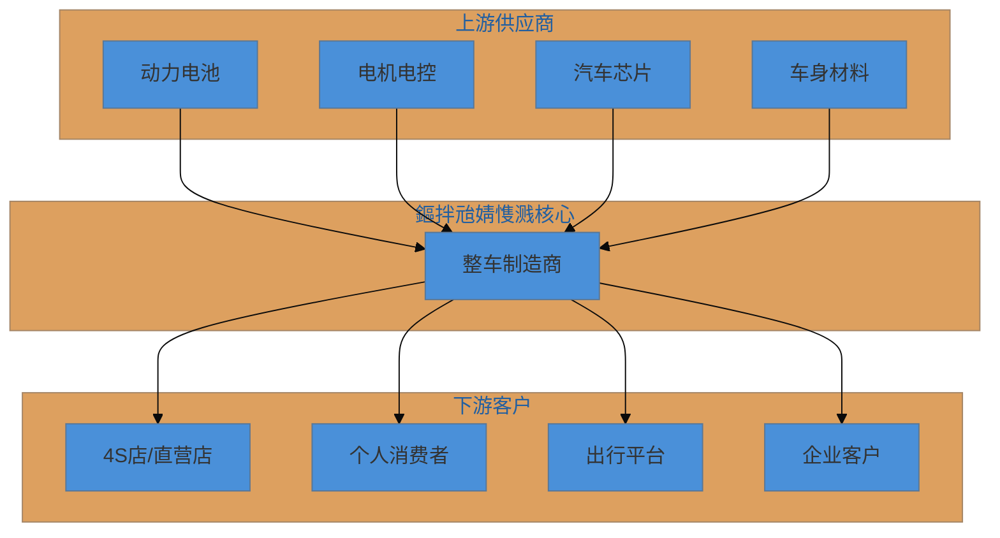
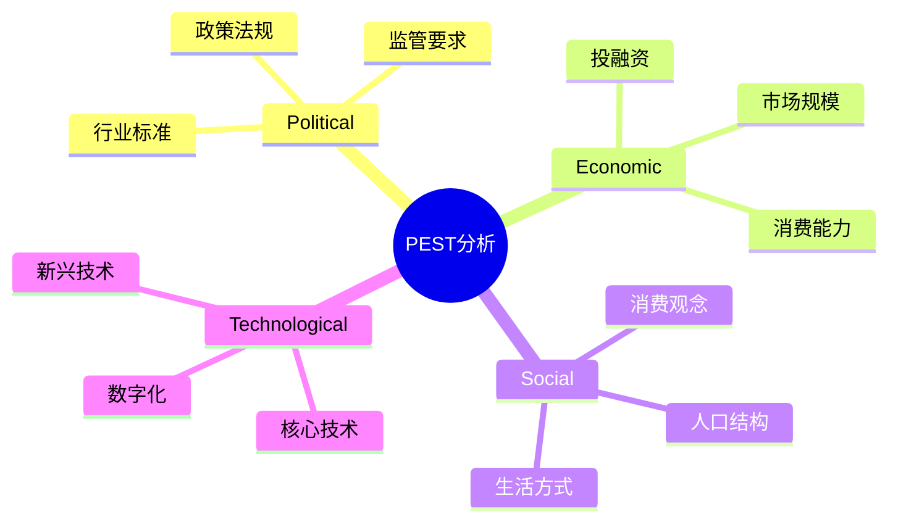
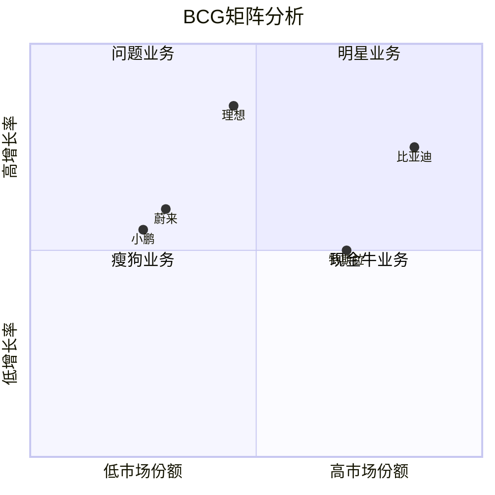
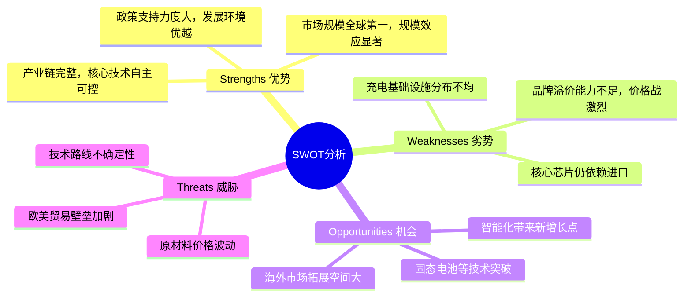

# 鏂拌兘婧愯溅行业分析报告

**报告日期**：2026年02月
**分析周期**：2024-2026年
**报告版本**：V1.0

---

## 目录

- [一、行业概览](#一行业概览)
  - [1.1 行业概况](#11-行业概况)
  - [1.2 行业基本数据](#12-行业基本数据)
  - [1.3 行业痛点](#13-行业痛点)
  - [1.4 商业模式](#14-商业模式)
  - [1.5 产业链位置](#15-产业链位置)
- [二、PEST环境分析](#二pest环境分析)
  - [2.1 政治法规环境](#21-政治法规环境)
  - [2.2 经济环境](#22-经济环境)
  - [2.3 社会文化环境](#23-社会文化环境)
  - [2.4 技术环境](#24-技术环境)
- [三、BCG矩阵分析](#三bcg矩阵分析)
- [四、SWOT战略分析](#四swot战略分析)
- [五、总结与建议](#五总结与建议)

---

## 一、行业概览

### 1.1 行业概况

#### 行业定义

新能源车是指采用非常规的车用燃料作为动力来源，综合车辆的动力控制和驱动方面的先进技术，形成的技术原理先进、具有新技术、新结构的汽车。主要包括纯电动汽车(BEV)、插电式混合动力汽车(PHEV)、增程式电动汽车(EREV)和燃料电池汽车(FCEV)。

#### 发展历程

中国新能源汽车产业经历了政策驱动期(2009-2015)、市场培育期(2016-2020)、快速增长期(2021-至今)三个阶段。2024年中国新能源汽车年产销量突破1000万辆，渗透率超过40%。

#### 当前发展阶段

快速增长期，行业已进入规模化发展阶段，市场渗透率持续提升

#### 核心特征

- 技术迭代快速
- 政策驱动明显
- 竞争格局分化
- 产业链完整
- 出口增长强劲

### 1.2 行业基本数据

| 指标 | 数值 | 数据来源 |
|------|------|----------|
| 全球市场规模 | 8500亿美元 | 中汽协、乘联会 |
| 中国市场规模 | 3.2万亿元 | 中汽协、乘联会 |
| 同比增长率 | 35% | 中汽协、乘联会 |
| 预测CAGR | 25% | 中汽协、乘联会 |

### 1.3 行业痛点

#### 技术层面痛点

- 续航里程焦虑
- 充电设施不足
- 电池安全隐患
- 低温性能衰减

#### 商业层面痛点

- 盈利能力不足
- 价格战激烈
- 品牌溢价低

#### 用户层面痛点

- 二手车残值低
- 保险费用高
- 维修成本不透明

#### 监管层面痛点

- 补贴退坡
- 碳积分政策调整
- 出口贸易壁垒

### 1.4 商业模式

整车销售为主，辅以软件订阅、充电服务、换电服务、金融服务等多元化盈利模式

### 1.5 产业链位置

上游为动力电池、电机电控、汽车芯片等核心零部件，中游为整车制造，下游为销售渠道和终端用户

---

## 二、PEST环境分析

### 2.1 政治法规环境 (Political)

国家持续出台新能源汽车支持政策，包括购置税减免、充电基础设施建设补贴、碳积分政策等。2025年新能源汽车渗透率目标为50%。

### 2.2 经济环境 (Economic)

居民消费能力提升，新能源汽车使用成本优势明显。油电价差扩大，电动车全生命周期成本更低。

### 2.3 社会文化环境 (Social)

环保意识增强，消费者对新能源汽车接受度提高。年轻消费群体更倾向于智能化、科技感强的新能源车型。

### 2.4 技术环境 (Technological)

电池能量密度持续提升，固态电池研发加速。智能驾驶技术快速迭代，城市NOA逐步落地。800V高压平台普及，充电速度大幅提升。

### 2.5 PEST综合评估

| 维度 | 机会 | 威胁 | 影响程度 |
|------|------|------|----------|
| Political | 政策持续支持 | 补贴退坡压力 | 利好 |
| Economic | 消费升级 | 价格战压力 | 利好 |
| Social | 年轻消费群体 | 里程焦虑 | 利好 |
| Technological | 技术突破 | 技术路线不确定 | 利好 |

---

## 三、BCG矩阵分析

### 3.1 市场定位分析

新能源汽车行业竞争格局分化明显，比亚迪凭借垂直整合优势稳居龙头，新势力品牌差异化竞争，传统车企加速转型。

### 3.2 各象限企业/业务

#### 明星业务 (Stars)
比亚迪、理想汽车 - 高增长、高份额，持续投入研发和产能扩张

#### 现金牛业务 (Cash Cows)
特斯拉中国 - 市场成熟，品牌溢价高，盈利能力强

#### 问题业务 (Question Marks)
蔚来、小鹏 - 高增长但份额待提升，需要持续投入

#### 瘦狗业务 (Dogs)
部分传统车企新能源品牌 - 转型缓慢，竞争力不足

### 3.3 战略建议

头部企业应加大技术投入巩固优势，新势力需差异化突围，传统车企需加速转型

---

## 四、SWOT战略分析

### 4.1 优势分析 (Strengths)

- 产业链完整，核心技术自主可控
- 市场规模全球第一，规模效应显著
- 政策支持力度大，发展环境优越
- 消费者接受度高，市场渗透率快速提升

### 4.2 劣势分析 (Weaknesses)

- 品牌溢价能力不足，价格战激烈
- 核心芯片仍依赖进口
- 充电基础设施分布不均
- 二手车市场不成熟

### 4.3 机会分析 (Opportunities)

- 海外市场拓展空间大
- 智能化带来新增长点
- 固态电池等技术突破
- 碳中和政策持续推动

### 4.4 威胁分析 (Threats)

- 欧美贸易壁垒加剧
- 原材料价格波动
- 技术路线不确定性
- 传统车企加速转型竞争

### 4.5 交叉策略分析

#### 优势-机会 (SO) 策略

利用产业链优势和政策支持，加速海外市场拓展；依托规模效应，加大智能化技术投入

#### 劣势-机会 (WO) 策略

通过海外市场拓展提升品牌溢价；借助技术突破机遇补齐芯片短板

#### 优势-威胁 (ST) 策略

利用产业链优势应对贸易壁垒；通过技术创新降低原材料依赖

#### 劣势-威胁 (WT) 策略

避免过度价格战，聚焦差异化竞争；加强供应链管理，降低风险

### 4.6 综合战略建议

坚持技术创新和品牌建设双轮驱动，加速海外布局，构建差异化竞争优势

---

## 五、总结与建议

### 5.1 关键洞察

1. **市场格局分化**：比亚迪一家独大，新势力三强分化，传统车企转型承压
2. **技术迭代加速**：固态电池、智能驾驶、800V高压平台成为竞争焦点
3. **出海成为必选**：国内竞争白热化，海外市场成为新增长极
4. **盈利能力待提升**：价格战压缩利润空间，需通过规模和技术降本

### 5.2 战略建议

#### 短期建议（1年内）

- 优化产品矩阵，覆盖更多价格带
- 加速充电网络布局
- 提升智能化体验

#### 中期建议（1-3年）

- 加大海外市场投入
- 推进固态电池量产
- 构建软件生态

#### 长期建议（3年以上）

- 打造全球化品牌
- 实现全栈自研
- 探索新商业模式

### 5.3 风险提示

| 风险类型 | 风险描述 | 发生概率 | 影响程度 | 应对措施 |
|----------|----------|----------|----------|----------|
| 政策风险 | 补贴退坡、碳积分政策调整 | 中 | 高 | 提升产品竞争力，降低政策依赖 |
| 市场风险 | 价格战加剧、需求放缓 | 高 | 高 | 差异化竞争，控制成本 |
| 技术风险 | 技术路线变化、竞争对手突破 | 中 | 中 | 多路线布局，持续研发投入 |
| 国际风险 | 贸易壁垒、地缘政治 | 高 | 高 | 本地化生产，多元化市场 |

---

## 附录

### 数据来源

- 中国汽车工业协会
- 乘用车市场信息联席会
- 国家统计局
- 各企业财报及公告
- 行业研究报告

### 免责声明

本报告基于公开信息和数据分析编制，仅供参考。报告中的观点和结论不构成任何投资建议。

