# 行业分析框架详细指南

本文档提供PEST分析、BCG矩阵、SWOT分析的详细执行指南。

## 一、PEST分析框架

### 1.1 分析目的

PEST分析用于评估宏观环境对行业的影响，识别外部机会与威胁。

### 1.2 四维度详细指标

#### Political（政治法规）

**核心关注点**：仅检索政策法规相关内容

| 指标类别 | 具体内容 |
|----------|----------|
| 法律法规 | 行业相关法律、行政法规、部门规章 |
| 产业政策 | 国家/地方产业政策、发展规划、扶持政策 |
| 监管要求 | 准入门槛、资质要求、合规标准 |
| 行业标准 | 国家标准、行业标准、团体标准 |
| 税收政策 | 税收优惠、补贴政策 |
| 贸易政策 | 进出口政策、关税政策 |

**搜索关键词示例**：
- "[行业] 政策法规 2024"
- "[行业] 监管要求"
- "[行业] 国家标准"
- "[行业] 产业政策"

#### Economic（经济环境）

**核心关注点**：重点关注居民消费相关指标

| 指标类别 | 具体内容 |
|----------|----------|
| 宏观经济 | GDP增长率、通货膨胀率、利率水平 |
| 居民收入 | 人均可支配收入、收入增长率 |
| 消费能力 | 消费支出、消费结构、消费升级 |
| 行业投资 | 投融资规模、资本流向、估值水平 |
| 成本因素 | 原材料成本、人力成本、运营成本 |
| 汇率影响 | 汇率波动对进出口的影响 |

**搜索关键词示例**：
- "居民消费 [行业] 支出"
- "[行业] 市场规模 增长率"
- "[行业] 投融资 2024"
- "消费升级 [行业]"

#### Social（社会文化）

**核心关注点**：重点关注消费观念、消费习惯

| 指标类别 | 具体内容 |
|----------|----------|
| 人口结构 | 年龄结构、城镇化率、家庭结构 |
| 消费观念 | 消费理念变化、品质追求、性价比意识 |
| 消费习惯 | 购买渠道偏好、消费频次、决策因素 |
| 生活方式 | 工作生活平衡、健康意识、休闲方式 |
| 社会价值观 | 环保意识、社会责任、文化认同 |
| 教育水平 | 受教育程度、专业技能需求 |

**搜索关键词示例**：
- "[行业] 消费者行为"
- "[行业] 消费趋势"
- "Z世代 [行业] 消费"
- "[行业] 用户画像"

#### Technological（技术环境）

**核心关注点**：重点关注媒介、网络、内容产业相关技术创新

| 指标类别 | 具体内容 |
|----------|----------|
| 核心技术 | 关键技术突破、技术成熟度、技术壁垒 |
| 数字化 | 数字化转型、智能化应用、数据驱动 |
| 新兴技术 | AI应用、大数据、云计算、物联网 |
| 媒介技术 | 新媒体、社交平台、内容分发 |
| 网络基础 | 5G/6G、网络覆盖、带宽提升 |
| 研发投入 | 行业研发强度、专利数量、创新能力 |

**搜索关键词示例**：
- "[行业] 技术趋势 2024"
- "[行业] AI应用"
- "[行业] 数字化转型"
- "[行业] 技术创新"

### 1.3 PEST分析输出模板

```markdown
## PEST分析报告

### 1. 政治法规环境 (Political)

#### 1.1 主要政策法规
- [具体政策1]：[影响分析]
- [具体政策2]：[影响分析]

#### 1.2 监管趋势
[分析监管趋势对行业的影响]

#### 1.3 政策影响评估
- 利好因素：[列举]
- 风险因素：[列举]

### 2. 经济环境 (Economic)

#### 2.1 宏观经济指标
- GDP增长率：[数据]
- 居民可支配收入：[数据]

#### 2.2 消费市场分析
[分析消费能力和消费结构]

#### 2.3 行业投融资情况
[分析资本市场对行业的态度]

### 3. 社会文化环境 (Social)

#### 3.1 人口结构变化
[分析人口结构对行业的影响]

#### 3.2 消费观念演变
[分析消费观念变化趋势]

#### 3.3 生活方式影响
[分析生活方式变化对行业的影响]

### 4. 技术环境 (Technological)

#### 4.1 核心技术发展
[分析关键技术进展]

#### 4.2 数字化转型
[分析数字化对行业的影响]

#### 4.3 新兴技术应用
[分析AI、大数据等技术的应用]

### 5. PEST综合评估

| 维度 | 机会 | 威胁 |
|------|------|------|
| Political | [机会点] | [威胁点] |
| Economic | [机会点] | [威胁点] |
| Social | [机会点] | [威胁点] |
| Technological | [机会点] | [威胁点] |

### 6. 结论与建议
[综合以上分析给出结论]
```

### 1.4 PEST Mermaid图表

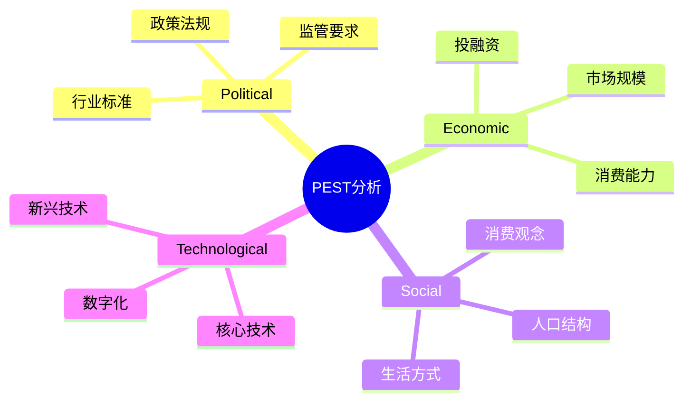
```mermaid
mindmap
  root((PEST分析))
    Political
      政策法规
      监管要求
      行业标准
    Economic
      市场规模
      消费能力
      投融资
    Social
      消费观念
      生活方式
      人口结构
    Technological
      核心技术
      数字化
      新兴技术
```

---

## 二、BCG矩阵分析框架

### 2.1 分析目的

BCG矩阵用于分析业务组合或竞争格局，指导资源配置决策。

### 2.2 两个核心维度

| 维度 | 定义 | 衡量标准 |
|------|------|----------|
| 市场增长率 | 行业/细分市场的增长速度 | >10%为高增长，<10%为低增长 |
| 相对市场份额 | 相对于最大竞争对手的份额比 | >1为高份额，<1为低份额 |

### 2.3 四象限定义与策略

#### 明星业务 (Stars)
- **特征**：高增长、高份额
- **现金流**：大量投入，收益也高
- **策略**：加大投资，维持领先地位
- **典型表现**：市场领导者，快速成长

#### 现金牛业务 (Cash Cows)
- **特征**：低增长、高份额
- **现金流**：稳定现金流入
- **策略**：维持现状，收割利润
- **典型表现**：成熟市场的领导者

#### 问题业务 (Question Marks)
- **特征**：高增长、低份额
- **现金流**：需要大量投入
- **策略**：选择性投资或放弃
- **典型表现**：新进入者，潜力待验证

#### 瘦狗业务 (Dogs)
- **特征**：低增长、低份额
- **现金流**：微利或亏损
- **策略**：收缩或退出
- **典型表现**：衰退市场的弱势者

### 2.4 BCG矩阵输出模板

```markdown
## BCG矩阵分析

### 1. 分析对象
[说明分析的是企业、产品线还是细分市场]

### 2. 数据基础

| 分析对象 | 市场增长率 | 相对市场份额 | 象限定位 |
|----------|------------|--------------|----------|
| [对象1] | [X%] | [X.X] | [象限] |
| [对象2] | [X%] | [X.X] | [象限] |
| ... | ... | ... | ... |

### 3. 象限分析

#### 3.1 明星业务
- [业务/企业名称]
- 特点：[描述]
- 建议：[策略建议]

#### 3.2 现金牛业务
- [业务/企业名称]
- 特点：[描述]
- 建议：[策略建议]

#### 3.3 问题业务
- [业务/企业名称]
- 特点：[描述]
- 建议：[策略建议]

#### 3.4 瘦狗业务
- [业务/企业名称]
- 特点：[描述]
- 建议：[策略建议]

### 4. 战略建议
[基于BCG矩阵的整体战略建议]
```

### 2.5 BCG矩阵 Mermaid图表

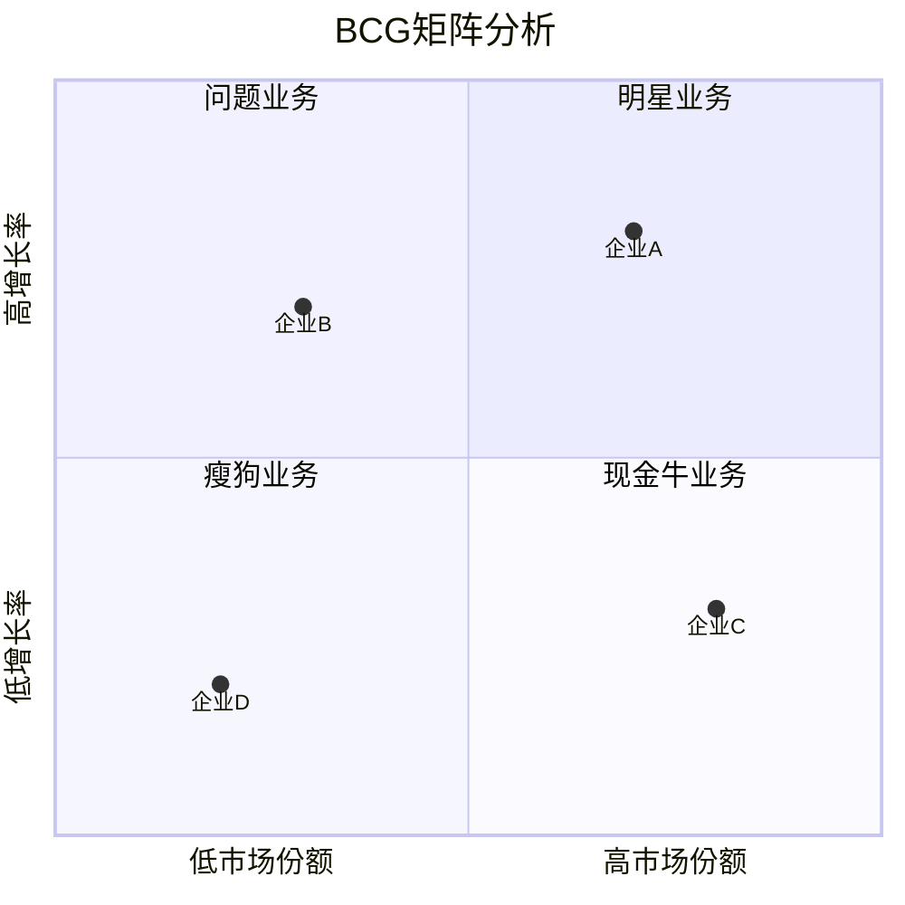
```mermaid
quadrantChart
    title BCG矩阵分析
    x-axis 低市场份额 --> 高市场份额
    y-axis 低增长率 --> 高增长率
    quadrant-1 明星业务
    quadrant-2 问题业务
    quadrant-3 瘦狗业务
    quadrant-4 现金牛业务
    企业A: [0.7, 0.8]
    企业B: [0.3, 0.7]
    企业C: [0.8, 0.3]
    企业D: [0.2, 0.2]
```

---

## 三、SWOT分析框架

### 3.1 分析目的

SWOT分析用于全面评估内外部环境，制定匹配的战略方案。

### 3.2 四维度定义

| 维度 | 类型 | 定义 | 关注点 |
|------|------|------|--------|
| Strengths | 内部/有利 | 组织的优势和能力 | 资源、能力、竞争优势 |
| Weaknesses | 内部/不利 | 组织的劣势和不足 | 短板、限制、改进空间 |
| Opportunities | 外部/有利 | 外部环境的机会 | 市场机会、政策利好、技术趋势 |
| Threats | 外部/不利 | 外部环境的威胁 | 竞争威胁、政策风险、技术替代 |

### 3.3 各维度分析要点

#### Strengths（优势）
- 技术优势：核心技术、专利、研发能力
- 资源优势：资金、人才、渠道、品牌
- 运营优势：效率、成本、质量、服务
- 市场优势：份额、客户关系、品牌认知

#### Weaknesses（劣势）
- 技术短板：技术差距、创新不足
- 资源限制：资金紧张、人才缺乏
- 运营问题：效率低下、成本过高
- 市场弱点：份额小、品牌弱、渠道窄

#### Opportunities（机会）
- 市场机会：需求增长、新市场、细分机会
- 政策机会：政策支持、监管放松
- 技术机会：技术突破、数字化转型
- 竞争机会：竞争格局变化、整合机会

#### Threats（威胁）
- 竞争威胁：新进入者、替代品、价格战
- 政策风险：监管收紧、政策变化
- 技术风险：技术替代、技术变革
- 市场风险：需求下降、经济波动

### 3.4 交叉策略分析

#### SO策略（进攻型）
- **逻辑**：利用优势抓住机会
- **目标**：最大化优势和机会
- **典型策略**：扩张、创新、领先

#### WO策略（改进型）
- **逻辑**：克服劣势抓住机会
- **目标**：利用机会弥补劣势
- **典型策略**：合作、学习、转型

#### ST策略（防御型）
- **逻辑**：利用优势应对威胁
- **目标**：用优势化解威胁
- **典型策略**：差异化、多元化、防守

#### WT策略（收缩型）
- **逻辑**：减少劣势避免威胁
- **目标**：最小化劣势和威胁
- **典型策略**：收缩、退出、止损

### 3.5 SWOT分析输出模板

```markdown
## SWOT分析报告

### 1. 内部优势 (Strengths)
1. [优势1]：[详细说明]
2. [优势2]：[详细说明]
3. [优势3]：[详细说明]

### 2. 内部劣势 (Weaknesses)
1. [劣势1]：[详细说明]
2. [劣势2]：[详细说明]
3. [劣势3]：[详细说明]

### 3. 外部机会 (Opportunities)
1. [机会1]：[详细说明]
2. [机会2]：[详细说明]
3. [机会3]：[详细说明]

### 4. 外部威胁 (Threats)
1. [威胁1]：[详细说明]
2. [威胁2]：[详细说明]
3. [威胁3]：[详细说明]

---

### 5. 交叉策略分析

#### 5.1 优势-机会 (SO) 策略
- [结论1]：[利用XX优势抓住XX机会]
- [结论2]：[利用XX优势抓住XX机会]
- **综合建议**：[一句话总结SO策略方向]

#### 5.2 劣势-机会 (WO) 策略
- [结论1]：[通过XX机会弥补XX劣势]
- [结论2]：[通过XX机会弥补XX劣势]
- **综合建议**：[一句话总结WO策略方向]

#### 5.3 优势-威胁 (ST) 策略
- [结论1]：[利用XX优势应对XX威胁]
- [结论2]：[利用XX优势应对XX威胁]
- **综合建议**：[一句话总结ST策略方向]

#### 5.4 劣势-威胁 (WT) 策略
- [结论1]：[减少XX劣势避免XX威胁]
- [结论2]：[减少XX劣势避免XX威胁]
- **综合建议**：[一句话总结WT策略方向]

---

### 6. 综合战略建议

[结合以上四个维度的交叉分析，给出整体战略建议，包括：]
- 核心战略方向
- 优先行动事项
- 风险防范措施
- 资源配置建议
```

### 3.6 SWOT Mermaid图表

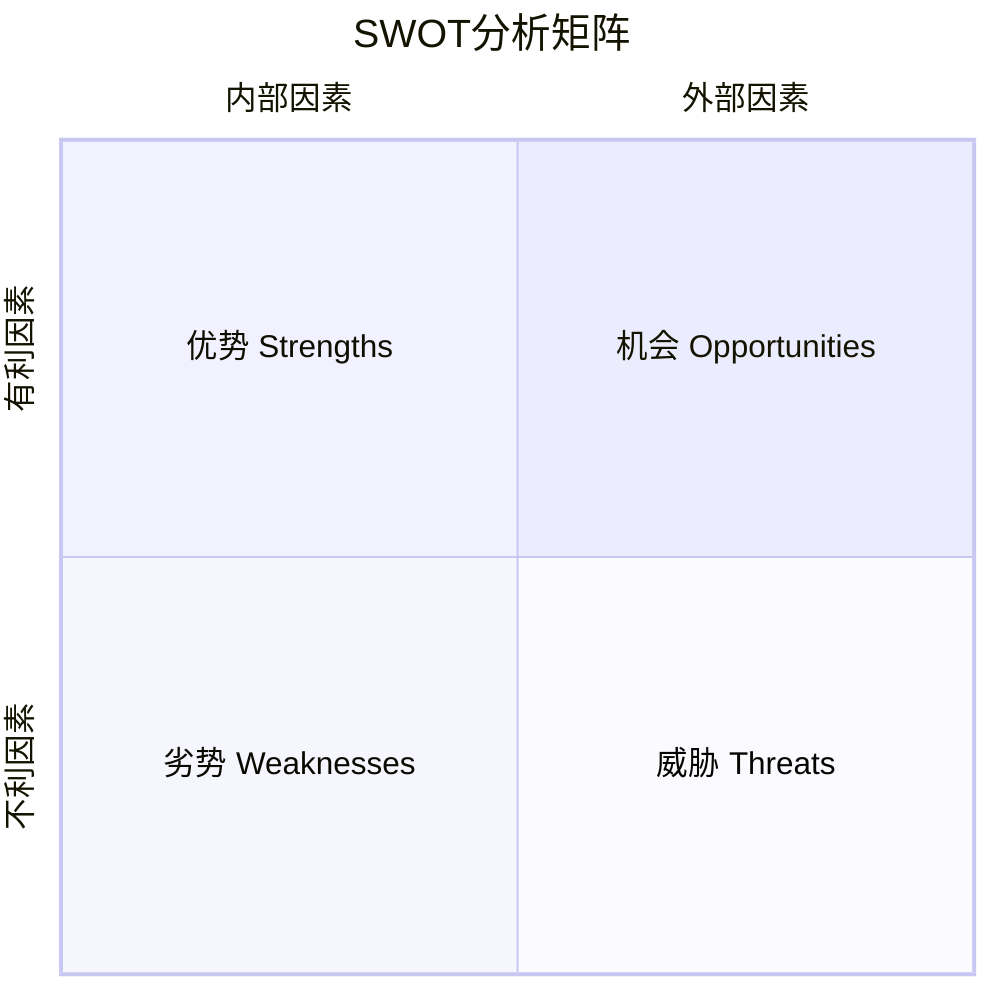
```mermaid
quadrantChart
    title SWOT分析矩阵
    x-axis 内部因素 --> 外部因素
    y-axis 不利因素 --> 有利因素
    quadrant-1 机会 Opportunities
    quadrant-2 优势 Strengths
    quadrant-3 劣势 Weaknesses
    quadrant-4 威胁 Threats
```

---

## 四、波特五力分析框架（补充）

### 4.1 五种竞争力量

1. **现有竞争者的竞争强度**
   - 竞争者数量和规模
   - 行业增长率
   - 产品差异化程度
   - 退出壁垒

2. **潜在进入者的威胁**
   - 进入壁垒高低
   - 规模经济效应
   - 品牌忠诚度
   - 资本需求

3. **替代品的威胁**
   - 替代品的可获得性
   - 替代品的性价比
   - 转换成本

4. **供应商的议价能力**
   - 供应商集中度
   - 供应商转换成本
   - 供应商前向整合能力

5. **购买者的议价能力**
   - 购买者集中度
   - 购买量占比
   - 产品差异化程度
   - 购买者后向整合能力

### 4.2 波特五力 Mermaid图表

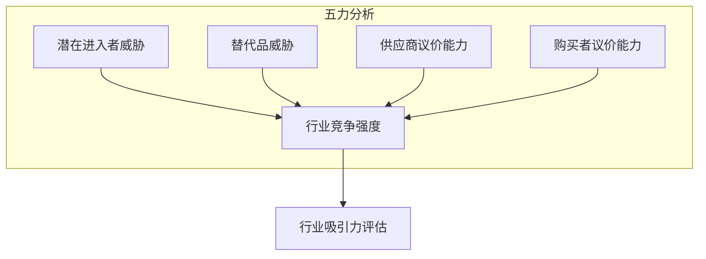
```mermaid
flowchart TB
    subgraph 五力分析
        A[潜在进入者威胁] --> C[行业竞争强度]
        B[替代品威胁] --> C
        D[供应商议价能力] --> C
        E[购买者议价能力] --> C
    end
    
    C --> F[行业吸引力评估]
```

---

## 五、分析框架使用建议

### 5.1 分析顺序

1. **先外后内**：先用PEST分析宏观环境，再用SWOT分析内外结合
2. **先宏观后微观**：先看行业整体，再看具体企业
3. **先定性后定量**：先理解逻辑，再用数据支撑

### 5.2 数据来源优先级

1. 官方统计数据（国家统计局、行业协会）
2. 权威研究报告（艾瑞、IDC、Gartner等）
3. 上市公司年报、招股书
4. 行业媒体报道
5. 专家访谈、调研数据

### 5.3 常见分析误区

- **避免**：罗列信息而不分析
- **避免**：主观臆断缺乏数据支撑
- **避免**：各维度分析相互矛盾
- **避免**：结论与分析脱节
- **避免**：策略建议过于笼统

---

## 六、数据可视化图表库

为保证报告图文并茂、可读性强，以下提供各类Mermaid图表的完整示例。

### 6.1 柱状图 (Bar Chart)

#### 基础柱状图

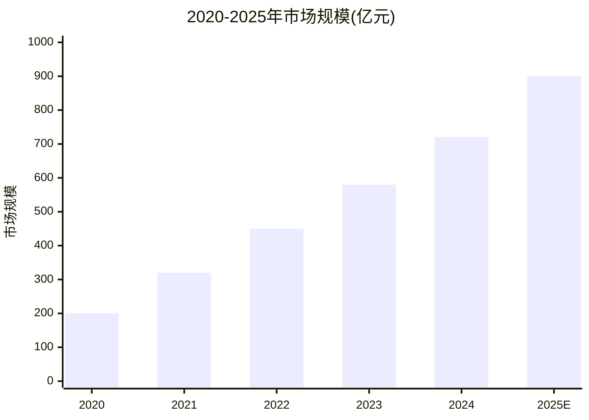
```mermaid
xychart-beta
    title "2020-2025年市场规模(亿元)"
    x-axis [2020, 2021, 2022, 2023, 2024, 2025E]
    y-axis "市场规模" 0 --> 1000
    bar [200, 320, 450, 580, 720, 900]
```

#### 带折线的柱状图

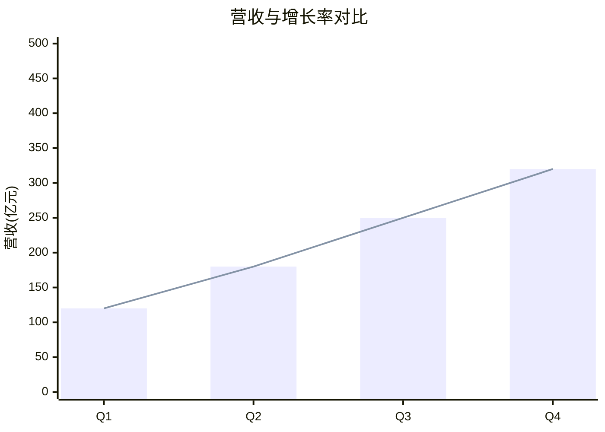
```mermaid
xychart-beta
    title "营收与增长率对比"
    x-axis [Q1, Q2, Q3, Q4]
    y-axis "营收(亿元)" 0 --> 500
    bar [120, 180, 250, 320]
    line [120, 180, 250, 320]
```

#### 多系列对比柱状图（使用说明）


```mermaid
xychart-beta
    title "中国vs全球市场规模对比(亿元)"
    x-axis [2021, 2022, 2023, 2024, 2025E]
    y-axis "规模" 0 --> 2000
    bar "中国市场" [300, 450, 620, 800, 1000]
    bar "全球市场" [800, 1100, 1400, 1700, 2000]
```

### 6.2 折线图 (Line Chart)

#### 单折线趋势图

```mermaid
xychart-beta
    title "用户增长趋势(万人)"
    x-axis [1月, 2月, 3月, 4月, 5月, 6月]
    y-axis "用户数" 0 --> 1000
    line [150, 280, 420, 550, 720, 900]
```

#### 多折线对比图

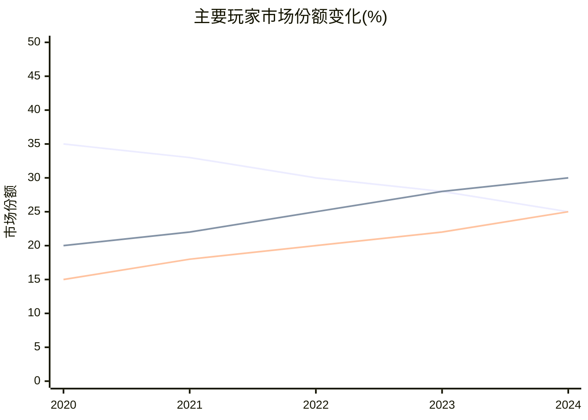
```mermaid
xychart-beta
    title "主要玩家市场份额变化(%)"
    x-axis [2020, 2021, 2022, 2023, 2024]
    y-axis "市场份额" 0 --> 50
    line "企业A" [35, 33, 30, 28, 25]
    line "企业B" [20, 22, 25, 28, 30]
    line "企业C" [15, 18, 20, 22, 25]
```

#### 增长率趋势图

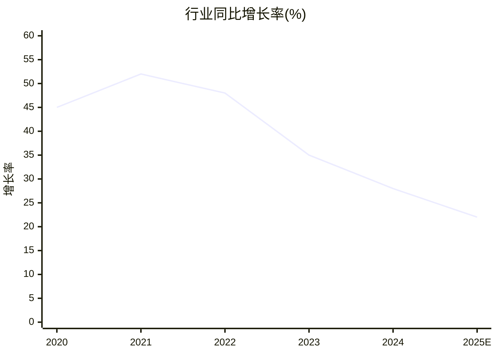
```mermaid
xychart-beta
    title "行业同比增长率(%)"
    x-axis [2020, 2021, 2022, 2023, 2024, 2025E]
    y-axis "增长率" 0 --> 60
    line [45, 52, 48, 35, 28, 22]
```

### 6.3 饼图 (Pie Chart)

#### 市场份额饼图

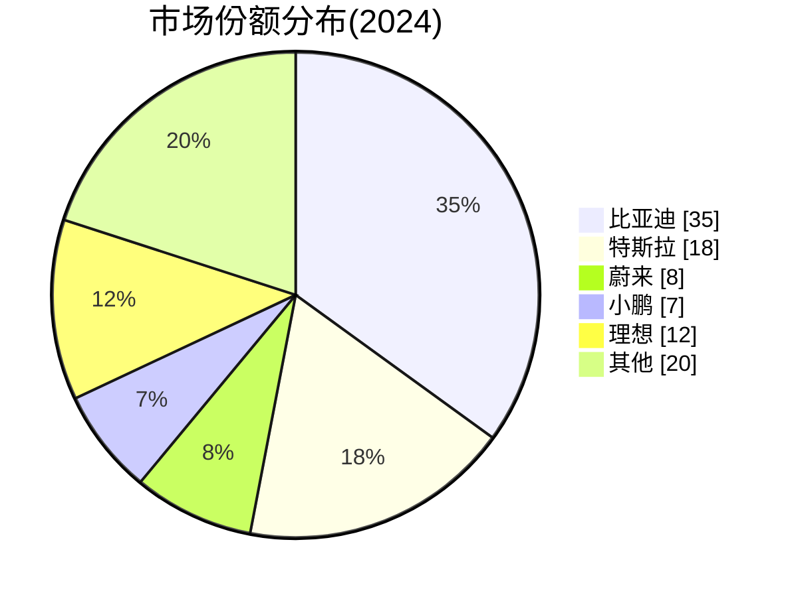
```mermaid
pie showData
    title 市场份额分布(2024)
    "比亚迪" : 35
    "特斯拉" : 18
    "蔚来" : 8
    "小鹏" : 7
    "理想" : 12
    "其他" : 20
```

#### 细分市场占比饼图

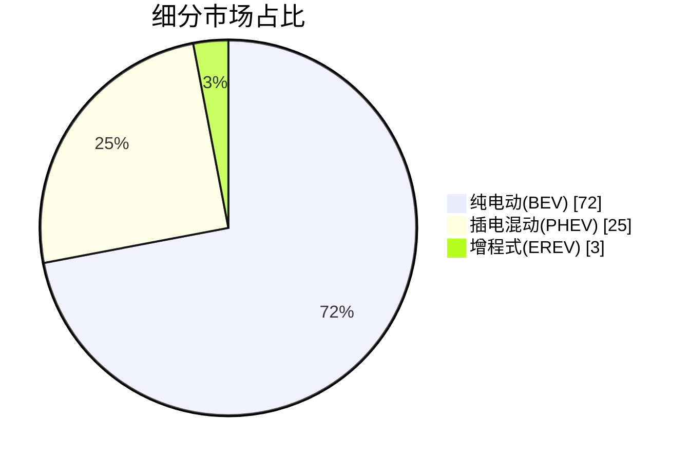
```mermaid
pie showData
    title 细分市场占比
    "纯电动(BEV)" : 72
    "插电混动(PHEV)" : 25
    "增程式(EREV)" : 3
```

#### 成本结构饼图

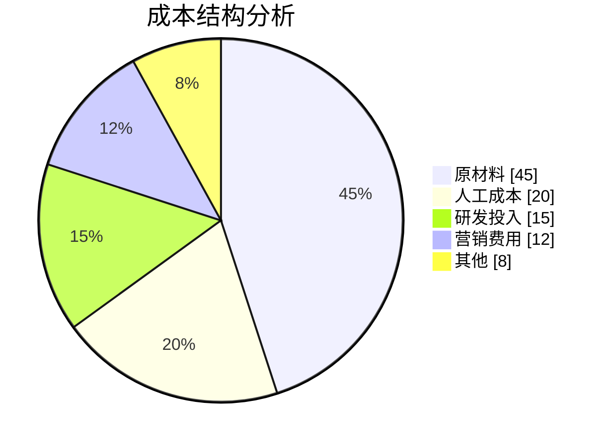
```mermaid
pie showData
    title 成本结构分析
    "原材料" : 45
    "人工成本" : 20
    "研发投入" : 15
    "营销费用" : 12
    "其他" : 8
```

#### 收入来源饼图

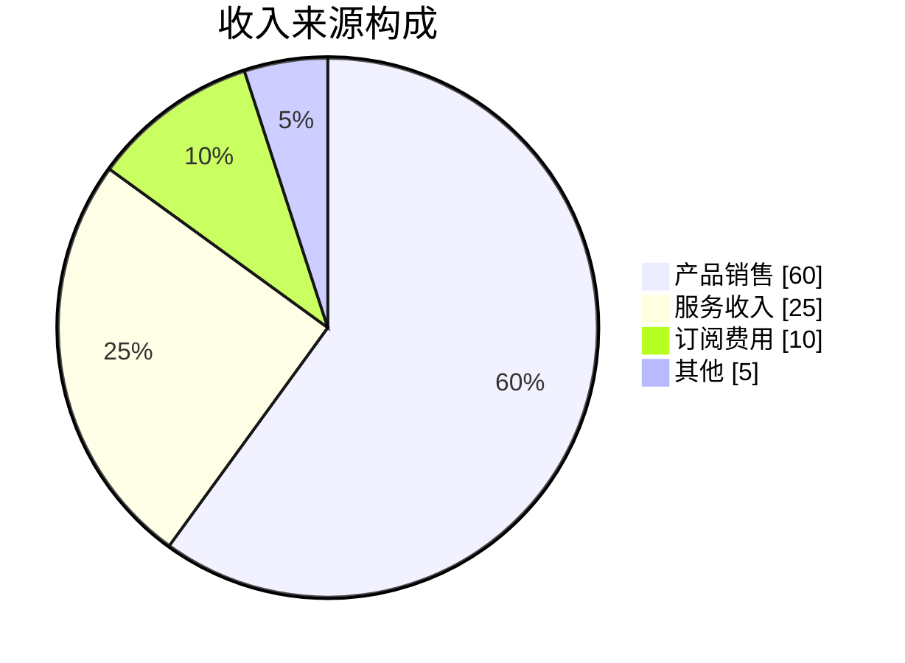
```mermaid
pie showData
    title 收入来源构成
    "产品销售" : 60
    "服务收入" : 25
    "订阅费用" : 10
    "其他" : 5
```

### 6.4 环形图（使用饼图模拟）

Mermaid原生不支持环形图，可用饼图替代，或在报告中说明：

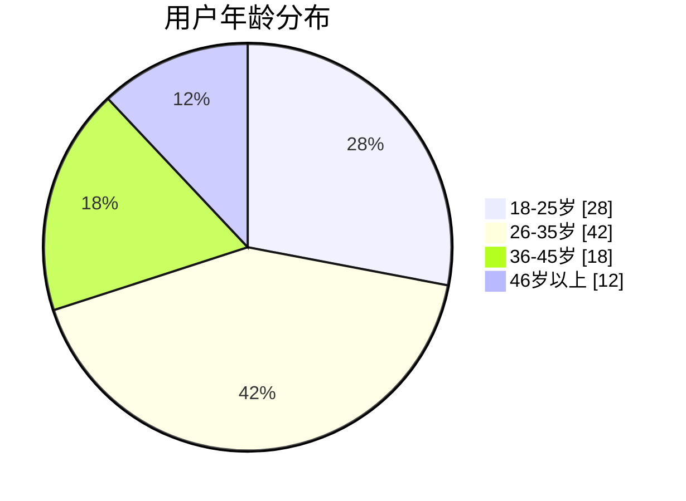
```mermaid
pie showData
    title 用户年龄分布
    "18-25岁" : 28
    "26-35岁" : 42
    "36-45岁" : 18
    "46岁以上" : 12
```

### 6.5 象限图 (Quadrant Chart)

#### BCG矩阵

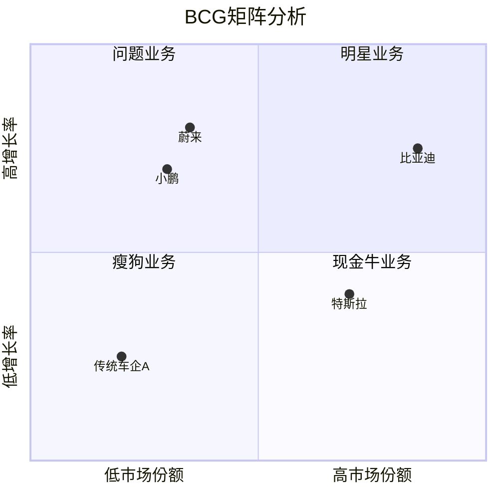
```mermaid
quadrantChart
    title BCG矩阵分析
    x-axis 低市场份额 --> 高市场份额
    y-axis 低增长率 --> 高增长率
    quadrant-1 明星业务
    quadrant-2 问题业务
    quadrant-3 瘦狗业务
    quadrant-4 现金牛业务
    比亚迪: [0.85, 0.75]
    特斯拉: [0.70, 0.40]
    蔚来: [0.35, 0.80]
    小鹏: [0.30, 0.70]
    传统车企A: [0.20, 0.25]
```

#### 竞争定位矩阵

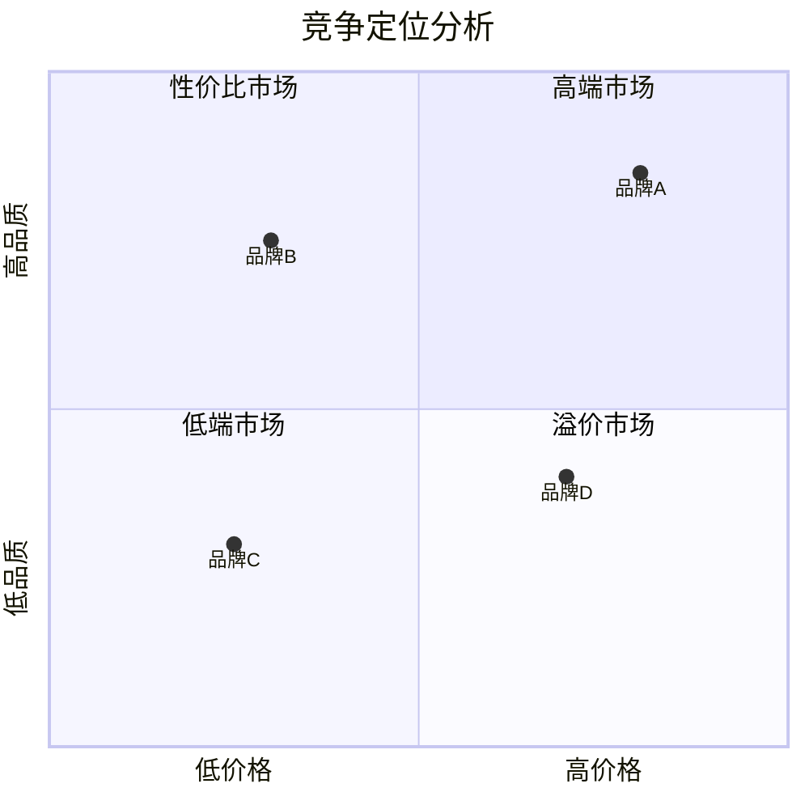
```mermaid
quadrantChart
    title 竞争定位分析
    x-axis 低价格 --> 高价格
    y-axis 低品质 --> 高品质
    quadrant-1 高端市场
    quadrant-2 性价比市场
    quadrant-3 低端市场
    quadrant-4 溢价市场
    品牌A: [0.80, 0.85]
    品牌B: [0.30, 0.75]
    品牌C: [0.25, 0.30]
    品牌D: [0.70, 0.40]
```

#### 优先级矩阵

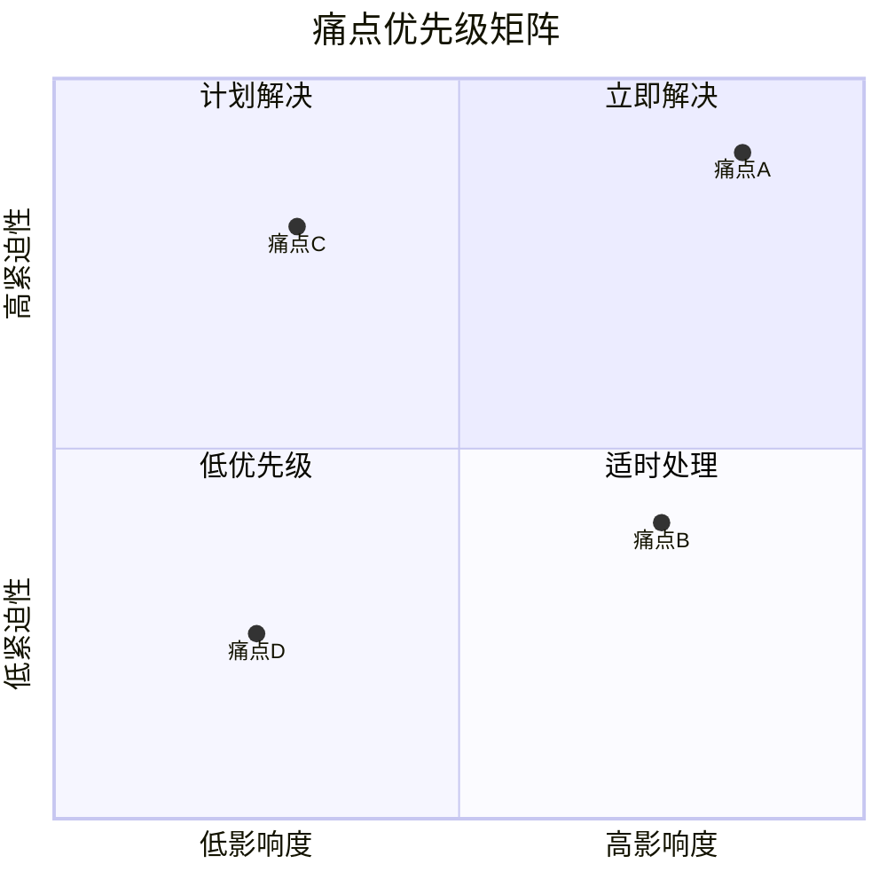
```mermaid
quadrantChart
    title 痛点优先级矩阵
    x-axis 低影响度 --> 高影响度
    y-axis 低紧迫性 --> 高紧迫性
    quadrant-1 立即解决
    quadrant-2 计划解决
    quadrant-3 低优先级
    quadrant-4 适时处理
    痛点A: [0.85, 0.90]
    痛点B: [0.75, 0.40]
    痛点C: [0.30, 0.80]
    痛点D: [0.25, 0.25]
```

### 6.6 思维导图 (Mind Map)

#### PEST分析思维导图

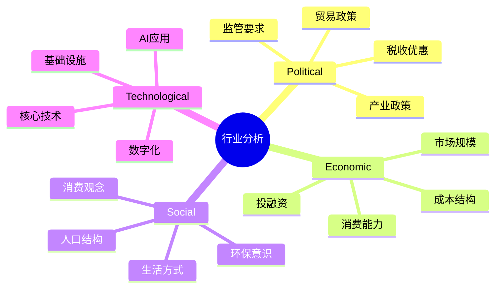
```mermaid
mindmap
  root((行业分析))
    Political
      产业政策
      监管要求
      税收优惠
      贸易政策
    Economic
      市场规模
      消费能力
      投融资
      成本结构
    Social
      消费观念
      人口结构
      生活方式
      环保意识
    Technological
      核心技术
      数字化
      AI应用
      基础设施
```

#### 竞争要素思维导图

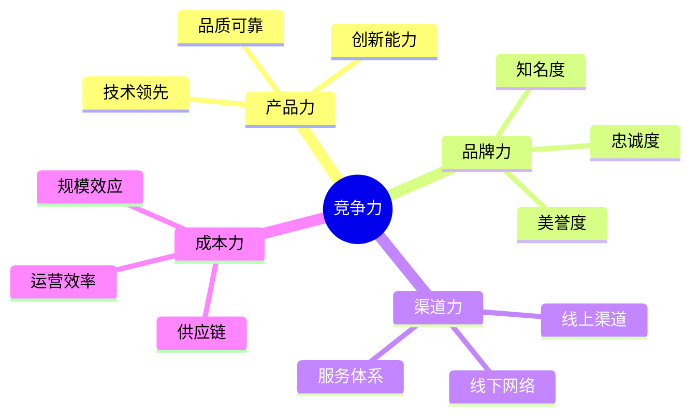
```mermaid
mindmap
  root((竞争力))
    产品力
      技术领先
      品质可靠
      创新能力
    品牌力
      知名度
      美誉度
      忠诚度
    渠道力
      线上渠道
      线下网络
      服务体系
    成本力
      规模效应
      供应链
      运营效率
```

#### 产业链思维导图

```mermaid
mindmap
  root((产业链))
    上游
      原材料
        锂矿
        钴镍
      零部件
        电池
        电机
        电控
    中游
      整车制造
        传统车企
        新势力
        跨界玩家
    下游
      销售渠道
        直营
        经销商
      终端用户
        个人
        企业
```

### 6.7 流程图 (Flowchart)

#### 产业链流程图

```mermaid
flowchart LR
    subgraph 上游["🔧 上游"]
        A1[原材料]
        A2[核心零部件]
        A3[技术服务]
    end
    
    subgraph 中游["🏭 中游"]
        B1[产品制造]
        B2[系统集成]
    end
    
    subgraph 下游["🛒 下游"]
        C1[渠道商]
        C2[终端用户]
    end
    
    A1 --> B1
    A2 --> B1
    A3 --> B2
    B1 --> B2
    B2 --> C1
    C1 --> C2
```

#### 商业模式流程图

```mermaid
flowchart TB
    subgraph 价值创造
        V1[研发创新] --> V2[产品设计]
        V2 --> V3[生产制造]
    end
    
    subgraph 价值传递
        V3 --> D1[营销推广]
        D1 --> D2[渠道分销]
        D2 --> D3[售后服务]
    end
    
    subgraph 价值获取
        D3 --> R1[产品收入]
        D3 --> R2[服务收入]
        D3 --> R3[增值收入]
    end
```

#### 用户旅程流程图

```mermaid
flowchart LR
    A[认知] --> B[兴趣]
    B --> C[考虑]
    C --> D[购买]
    D --> E[使用]
    E --> F[推荐]
    
    A -.-> |广告触达| B
    B -.-> |内容种草| C
    C -.-> |对比评测| D
    D -.-> |交付体验| E
    E -.-> |口碑传播| F
```

### 6.8 时间线图 (Timeline)

#### 行业发展历程

```mermaid
timeline
    title 新能源汽车行业发展历程
    2009 : 十城千辆示范推广
    2012 : 产业规划出台
    2015 : 补贴政策完善
    2018 : 双积分政策实施
    2020 : 新能源汽车下乡
    2022 : 补贴退坡
    2024 : 智能化加速
    2025 : 渗透率超50%
```

#### 产品迭代时间线

```mermaid
timeline
    title 产品版本迭代
    V1.0 : MVP发布
        : 核心功能上线
    V2.0 : 功能完善
        : 用户体验优化
    V3.0 : 智能化升级
        : AI能力集成
    V4.0 : 生态构建
        : 平台化运营
```

### 6.9 甘特图 (Gantt Chart)

#### 项目规划甘特图

```mermaid
gantt
    title 行业发展阶段规划
    dateFormat YYYY
    section 市场培育期
        政策扶持           :2020, 2022
        基础设施建设       :2020, 2023
    section 快速成长期
        产品迭代加速       :2022, 2025
        市场规模扩张       :2023, 2026
    section 成熟发展期
        行业整合           :2025, 2028
        盈利能力提升       :2026, 2030
```

### 6.10 图表使用原则

#### 图表选择指南

| 数据类型 | 推荐图表 | 适用场景 |
|----------|----------|----------|
| 时间序列 | 折线图/柱状图 | 趋势展示、增长对比 |
| 占比分布 | 饼图 | 市场份额、成本结构 |
| 多维对比 | 象限图 | BCG矩阵、竞争定位 |
| 层级关系 | 思维导图 | PEST分析、知识结构 |
| 流程逻辑 | 流程图 | 产业链、商业模式 |
| 时间节点 | 时间线/甘特图 | 发展历程、项目规划 |

#### 图文并茂原则

1. **每个章节至少1张图表**：用可视化增强理解
2. **数据驱动**：图表必须有数据支撑，避免纯装饰
3. **图文呼应**：文字描述与图表内容相互印证
4. **简洁清晰**：避免信息过载，突出关键信息
5. **风格统一**：全文图表风格保持一致
