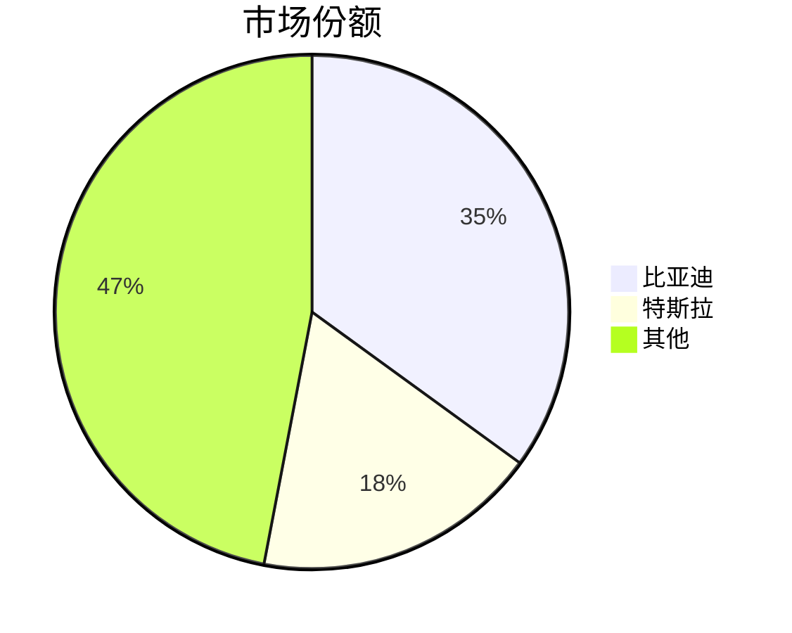

# ASCII图表可视化指南

本文档提供ASCII图表的使用说明和示例，用于解决Mermaid在某些平台渲染不佳的问题。

## 一、为什么使用ASCII图表

### 1.1 Mermaid的局限性

| 问题 | 说明 |
|------|------|
| 平台兼容性 | 部分平台不支持Mermaid渲染 |
| 渲染依赖 | 需要JavaScript环境支持 |
| 样式不一致 | 不同平台渲染效果差异大 |
| 复制粘贴 | 复制后可能丢失格式 |

### 1.2 ASCII图表的优势

| 优势 | 说明 |
|------|------|
| 通用兼容 | 任何文本环境都能正确显示 |
| 无需渲染 | 纯文本，即见即所得 |
| 易于复制 | 复制粘贴不丢失格式 |
| 轻量快速 | 生成速度快，体积小 |

### 1.3 使用场景建议

| 场景 | 推荐格式 |
|------|----------|
| Markdown文档/GitHub | Mermaid |
| 终端/命令行输出 | ASCII |
| 邮件/即时通讯 | ASCII |
| 纯文本报告 | ASCII |
| 不确定平台 | ASCII优先 |

---

## 二、支持的图表类型

| 图表类型 | 函数名 | 用途 |
|----------|--------|------|
| 柱状图 | `bar_chart` | 数据对比、趋势展示 |
| 占比图 | `pie_chart_text` | 市场份额、成本结构 |
| 趋势图 | `trend_chart` | 时间序列数据 |
| 四象限图 | `quadrant_chart` | BCG矩阵、定位分析 |
| 水平流程图 | `flow_chart` | 简单流程 |
| 垂直流程图 | `vertical_flow_chart` | 复杂流程 |
| 对比表格 | `comparison_table` | 多维度对比 |
| SWOT矩阵 | `swot_matrix` | SWOT分析 |
| BCG矩阵 | `bcg_matrix` | BCG分析 |
| PEST分析 | `pest_diagram` | PEST分析 |
| 产业链图 | `industry_chain` | 产业链分析 |
| 评分卡 | `score_card` | 能力评估 |

---

## 三、图表示例

### 3.1 柱状图

```
  季度营收对比
  ────────────────────────────────────────────────────────
  Q1     │████████████████████░░░░░░░░░░░░░░░░░░░░│ 100
  Q2     │██████████████████████████████░░░░░░░░░░│ 150
  Q3     │████████████████████████████████████░░░░│ 180
  Q4     │████████████████████████████████████████│ 200
  ────────────────────────────────────────────────────────
```

### 3.2 占比图（饼图替代）

```
┌──────────────────────────────────────────────────┐
│                    市场份额分布                    │
├──────────────────────────────────────────────────┤
│ 比亚迪       ██████████████░░░░░░░░░░░░░░░░  35.0% │
│ 特斯拉       ███████░░░░░░░░░░░░░░░░░░░░░░░  18.0% │
│ 理想         █████░░░░░░░░░░░░░░░░░░░░░░░░░  12.0% │
│ 蔚来         ███░░░░░░░░░░░░░░░░░░░░░░░░░░░   8.0% │
│ 其他         █████████░░░░░░░░░░░░░░░░░░░░░  27.0% │
├──────────────────────────────────────────────────┤
│  总计                                       100.0% │
└──────────────────────────────────────────────────┘
```

### 3.3 SWOT矩阵

```
                    SWOT分析                     

  ┌───────────────────────────────────┬───────────────────────────────────┐
  │      ✅ Strengths 优势             │      ❌ Weaknesses 劣势            │
  ├───────────────────────────────────┼───────────────────────────────────┤
  │• 产业链完整                        │• 品牌溢价能力不足                   │
  │• 市场规模全球第一                   │• 核心芯片依赖进口                   │
  │• 政策支持力度大                     │• 充电设施分布不均                   │
  ├───────────────────────────────────┼───────────────────────────────────┤
  │      🎯 Opportunities 机会         │      ⚠️ Threats 威胁               │
  ├───────────────────────────────────┼───────────────────────────────────┤
  │• 海外市场拓展空间大                 │• 欧美贸易壁垒加剧                   │
  │• 智能化带来新增长点                 │• 原材料价格波动                     │
  │• 固态电池等技术突破                 │• 技术路线不确定性                   │
  └───────────────────────────────────┴───────────────────────────────────┘
```

### 3.4 BCG矩阵

```
                    BCG矩阵                     

  市场增长率 ↑
  高
  ┌──────────────────────────────┬──────────────────────────────┐
  │       ❓ 问题业务              │       ⭐ 明星业务              │
  │       (高增长/低份额)          │       (高增长/高份额)          │
  ├──────────────────────────────┼──────────────────────────────┤
  │• 蔚来                         │• 比亚迪                       │
  │• 小鹏                         │• 理想汽车                     │
  ├──────────────────────────────┼──────────────────────────────┤
  │       🐕 瘦狗业务              │       🐄 现金牛业务            │
  │       (低增长/低份额)          │       (低增长/高份额)          │
  ├──────────────────────────────┼──────────────────────────────┤
  │• 部分传统车企新能源品牌         │• 特斯拉中国                   │
  └──────────────────────────────┴──────────────────────────────┘
  低                    低               高
                    相对市场份额 →
```

### 3.5 PEST分析

```
                    PEST分析                     

  ┌──────────────────────────────┬──────────────────────────────┐
  │    🏛️ Political 政治法规      │    💰 Economic 经济环境       │
  ├──────────────────────────────┼──────────────────────────────┤
  │• 购置税减免延续                │• 油电价差扩大                 │
  │• 充电设施补贴                  │• 使用成本优势                 │
  │• 双积分政策                    │• 消费升级趋势                 │
  ├──────────────────────────────┼──────────────────────────────┤
  │    👥 Social 社会文化         │    🔧 Technological 技术环境  │
  ├──────────────────────────────┼──────────────────────────────┤
  │• 环保意识增强                  │• 固态电池研发                 │
  │• 年轻化消费                    │• 智能驾驶迭代                 │
  │• 出行方式变革                  │• 充电技术进步                 │
  └──────────────────────────────┴──────────────────────────────┘
```

### 3.6 产业链图

```
  产业链图

  ┌────────────────────────────────────────────────────────────────┐
  │                        📦 上游供应                              │
  ├────────────────────────────────────────────────────────────────┤
  │ [    电池供应商    ] [    电机供应商    ] [    芯片供应商    ]  │
  └────────────────────────────────────────────────────────────────┘
                                    │
                                    ▼
  ┌────────────────────────────────────────────────────────────────┐
  │                        🏭 中游制造                              │
  ├────────────────────────────────────────────────────────────────┤
  │ [   整车制造商    ] [   系统集成商    ]                        │
  └────────────────────────────────────────────────────────────────┘
                                    │
                                    ▼
  ┌────────────────────────────────────────────────────────────────┐
  │                        🛒 下游客户                              │
  ├────────────────────────────────────────────────────────────────┤
  │ [   个人消费者    ] [   网约车平台    ] [    企业客户    ]     │
  └────────────────────────────────────────────────────────────────┘
```

### 3.7 流程图（水平）

```
  工作流程

  ┌──────────────┐    ┌──────────────┐    ┌──────────────┐    ┌──────────────┐
  │   需求分析   │ ──→ │   方案设计   │ ──→ │   开发实施   │ ──→ │   测试上线   │
  └──────────────┘    └──────────────┘    └──────────────┘    └──────────────┘
```

### 3.8 评分卡

```
  ┌──────────────────────────────────────────────────┐
  │                  竞品能力评估                      │
  ├──────────────────────────────────────────────────┤
  │ 产品力         ★★★★★ ████████████████████░░░░ 5/5 │
  │ 技术实力       ★★★★☆ ████████████████░░░░░░░░ 4/5 │
  │ 品牌影响力     ★★★★☆ ████████████████░░░░░░░░ 4/5 │
  │ 渠道能力       ★★★★★ ████████████████████░░░░ 5/5 │
  │ 价格竞争力     ★★★★★ ████████████████████░░░░ 5/5 │
  │ 服务质量       ★★★★☆ ████████████████░░░░░░░░ 4/5 │
  └──────────────────────────────────────────────────┘
```

### 3.9 对比表格

```
  竞品对比

  ┌──────────┬──────────┬──────────┬──────────┐
  │   指标   │  企业A   │  企业B   │  企业C   │
  ├──────────┼──────────┼──────────┼──────────┤
  │ 市场份额 │   35%    │   18%    │   12%    │
  ├──────────┼──────────┼──────────┼──────────┤
  │ 增长率   │   45%    │   20%    │   35%    │
  ├──────────┼──────────┼──────────┼──────────┤
  │ 产品线   │    8     │    5     │    3     │
  └──────────┴──────────┴──────────┴──────────┘
```

---

## 四、使用方法

### 4.1 命令行使用

```bash
# 直接使用 ascii_charts.py
python ascii_charts.py bar '{"data":[{"label":"Q1","value":100},{"label":"Q2","value":150}]}'
python ascii_charts.py swot '{"strengths":["优势1"],"weaknesses":["劣势1"],"opportunities":["机会1"],"threats":["威胁1"]}'
python ascii_charts.py bcg '{"stars":["比亚迪"],"cash_cows":["特斯拉"],"question_marks":["蔚来"],"dogs":["其他"]}'

# 通过 mermaid_generator.py 使用 --ascii 选项
python mermaid_generator.py --ascii chain '{"upstream":["供应商"],"midstream":["制造商"],"downstream":["客户"]}'
python mermaid_generator.py --ascii pest '{"political":["政策1"],"economic":["经济1"],"social":["社会1"],"technological":["技术1"]}'
```

### 4.2 Python代码调用

```python
from ascii_charts import ASCIICharts

# 柱状图
data = [
    {"label": "Q1", "value": 100},
    {"label": "Q2", "value": 150},
    {"label": "Q3", "value": 200},
]
print(ASCIICharts.bar_chart(data, "季度营收"))

# SWOT矩阵
print(ASCIICharts.swot_matrix(
    strengths=["产业链完整", "市场规模大"],
    weaknesses=["品牌溢价不足", "芯片依赖进口"],
    opportunities=["海外市场", "智能化"],
    threats=["贸易壁垒", "原材料波动"],
    title="新能源汽车行业SWOT分析"
))

# BCG矩阵
print(ASCIICharts.bcg_matrix(
    stars=["比亚迪", "理想"],
    cash_cows=["特斯拉中国"],
    question_marks=["蔚来", "小鹏"],
    dogs=["传统车企新能源品牌"],
    title="新能源汽车BCG矩阵"
))
```

---

## 五、Mermaid vs ASCII 对照表

| 功能 | Mermaid命令 | ASCII命令 |
|------|-------------|-----------|
| 产业链图 | `mermaid_generator.py chain` | `mermaid_generator.py --ascii chain` |
| PEST分析 | `mermaid_generator.py pest` | `mermaid_generator.py --ascii pest` |
| BCG矩阵 | `mermaid_generator.py bcg` | `mermaid_generator.py --ascii bcg` |
| SWOT分析 | `mermaid_generator.py swot` | `mermaid_generator.py --ascii swot` |
| 饼图/占比图 | `mermaid_generator.py pie` | `mermaid_generator.py --ascii pie` |
| 趋势图 | `mermaid_generator.py trend` | `mermaid_generator.py --ascii trend` |
| 流程图 | `mermaid_generator.py journey` | `mermaid_generator.py --ascii flow` |

---

## 六、最佳实践

### 6.1 格式选择决策树

```
需要生成图表？
    │
    ├── 目标平台支持Mermaid？
    │       │
    │       ├── 是 → 使用Mermaid（更美观）
    │       │
    │       └── 否/不确定 → 使用ASCII（更兼容）
    │
    └── 纯文本环境？ → 使用ASCII
```

### 6.2 报告中的混合使用

建议在报告中同时提供两种格式：

```markdown
## 市场份额分析

### 图表（Mermaid格式，需渲染支持）



### 图表（ASCII格式，通用兼容）

```
┌──────────────────────────────────────────────────┐
│                    市场份额分布                    │
├──────────────────────────────────────────────────┤
│ 比亚迪       ██████████████░░░░░░░░░░░░░░░░  35.0% │
│ 特斯拉       ███████░░░░░░░░░░░░░░░░░░░░░░░  18.0% │
│ 其他         ██████████████████░░░░░░░░░░░░  47.0% │
└──────────────────────────────────────────────────┘
```
```

### 6.3 字符编码注意事项

1. 确保文件使用UTF-8编码
2. 终端需支持Unicode字符显示
3. 如遇乱码，检查终端编码设置
