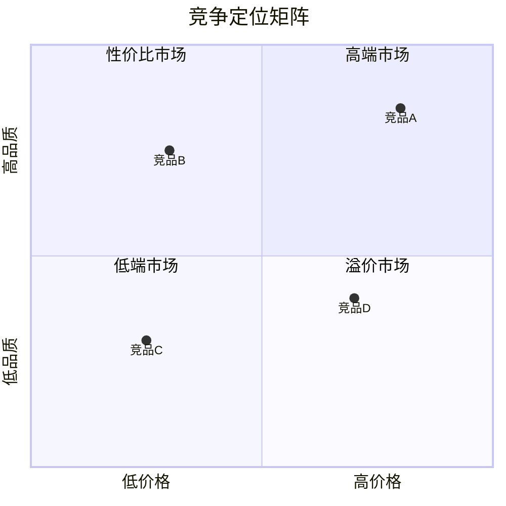

# 竞品分析框架指南

本文档提供竞品分析的完整框架、维度说明和执行指南。

## 一、竞品分析概述

### 1.1 分析目的

| 目的 | 说明 |
|------|------|
| 了解竞争格局 | 掌握市场主要玩家及其定位 |
| 识别竞争优劣势 | 找出自身与竞品的差距和优势 |
| 发现市场机会 | 识别竞品未覆盖的市场空白 |
| 制定竞争策略 | 基于分析制定有效的竞争应对方案 |
| 学习最佳实践 | 借鉴竞品的成功经验 |

### 1.2 竞品选择原则

| 竞品类型 | 定义 | 分析重点 |
|----------|------|----------|
| 直接竞品 | 产品形态和目标客户高度重合 | 产品功能、价格、渠道、服务 |
| 间接竞品 | 满足相同需求但形态不同 | 替代威胁、差异化机会 |
| 潜在竞品 | 未来可能进入的玩家 | 进入门槛、可能的竞争策略 |
| 标杆竞品 | 行业领先者或跨界优秀案例 | 最佳实践、发展路径 |

### 1.3 竞品数量建议

| 分析深度 | 竞品数量 | 适用场景 |
|----------|----------|----------|
| 快速扫描 | 3-5家 | 初步了解竞争格局 |
| 深度分析 | 5-8家 | 制定竞争策略 |
| 全面研究 | 8-15家 | 行业研究报告 |

---

## 二、竞品分析维度

### 2.1 基本信息维度

| 信息项 | 数据来源 | 重要性 |
|--------|----------|--------|
| 公司名称 | 官网、工商信息 | ★★★★★ |
| 成立时间 | 工商信息、官网 | ★★★☆☆ |
| 融资情况 | IT桔子、天眼查 | ★★★★☆ |
| 估值/市值 | 财报、融资新闻 | ★★★★☆ |
| 员工规模 | 招聘网站、年报 | ★★★☆☆ |
| 核心团队 | 官网、LinkedIn | ★★★☆☆ |
| 核心业务 | 官网、产品介绍 | ★★★★★ |

### 2.2 产品维度

| 分析项 | 关注点 | 数据来源 |
|--------|--------|----------|
| 产品线 | 产品数量、覆盖范围 | 官网、应用商店 |
| 核心功能 | 主要功能、特色功能 | 产品体验、用户评价 |
| 用户体验 | 界面设计、使用流程 | 实际体验 |
| 技术架构 | 技术栈、专利 | 技术博客、招聘JD |
| 产品定价 | 价格策略、收费模式 | 官网、销售咨询 |
| 产品迭代 | 更新频率、新功能 | 版本记录、公告 |

### 2.3 市场维度

| 分析项 | 关注点 | 数据来源 |
|--------|--------|----------|
| 市场份额 | 市场占有率、排名 | 行业报告、财报 |
| 目标客户 | 客户画像、主攻领域 | 案例、官网 |
| 获客渠道 | 主要获客方式 | 广告监测、内容分析 |
| 品牌影响力 | 知名度、口碑 | 搜索指数、社交媒体 |
| 地域覆盖 | 主要市场区域 | 官网、新闻报道 |

### 2.4 运营维度

| 分析项 | 关注点 | 数据来源 |
|--------|--------|----------|
| 营收规模 | 年营收、增长率 | 财报、新闻 |
| 盈利能力 | 利润率、盈亏状况 | 财报 |
| 成本结构 | 主要成本构成 | 财报、行业分析 |
| 组织架构 | 部门设置、人员配置 | 招聘信息、组织图 |
| 合作伙伴 | 战略合作、生态建设 | 官网、新闻 |

### 2.5 战略维度

| 分析项 | 关注点 | 数据来源 |
|--------|--------|----------|
| 发展战略 | 公司战略方向 | 财报、创始人访谈 |
| 竞争策略 | 市场竞争方式 | 市场行为分析 |
| 创新能力 | 研发投入、专利 | 财报、专利数据库 |
| 国际化 | 海外布局、出海策略 | 官网、新闻 |

---

## 三、能力评分体系

### 3.1 评分维度定义

| 维度 | 定义 | 评分要点 |
|------|------|----------|
| 产品力 | 产品的功能完整性、用户体验、创新性 | 功能覆盖度、易用性、差异化功能 |
| 技术实力 | 核心技术能力、研发投入、专利储备 | 技术领先性、专利数量、研发团队 |
| 品牌影响力 | 品牌知名度、美誉度、忠诚度 | 搜索指数、用户口碑、复购率 |
| 渠道能力 | 销售网络、获客能力、渠道覆盖 | 渠道数量、获客成本、转化率 |
| 价格竞争力 | 定价策略、性价比、成本控制 | 价格水平、成本优势、折扣力度 |
| 服务质量 | 客户服务水平、响应速度、满意度 | 服务响应、问题解决率、NPS |
| 市场份额 | 当前市场占有率 | 销量排名、收入占比 |
| 增长势头 | 增长速度、发展潜力 | 增长率、扩张速度、投入力度 |

### 3.2 评分标准

| 分数 | 等级 | 标准描述 |
|------|------|----------|
| 5 | 卓越 | 行业领先，具有显著竞争优势 |
| 4 | 优秀 | 高于行业平均，具有一定优势 |
| 3 | 中等 | 达到行业平均水平 |
| 2 | 较弱 | 低于行业平均，存在明显短板 |
| 1 | 薄弱 | 明显落后，亟需改进 |

### 3.3 评分数据来源

| 维度 | 定量指标 | 定性判断 |
|------|----------|----------|
| 产品力 | 功能数量、用户评分 | 产品体验、专家评价 |
| 技术实力 | 专利数量、研发投入占比 | 技术评测、行业认可 |
| 品牌影响力 | 搜索指数、社交声量 | 品牌感知、口碑 |
| 渠道能力 | 渠道数量、覆盖率 | 渠道质量、合作关系 |
| 价格竞争力 | 价格水平、折扣幅度 | 性价比感知 |
| 服务质量 | 响应时间、解决率 | 用户反馈、满意度 |
| 市场份额 | 销量、收入数据 | 行业排名 |
| 增长势头 | 增长率、投资金额 | 战略动向、市场信号 |

---

## 四、竞品定位分析

### 4.1 定位矩阵

常用的竞品定位矩阵：

#### 价格-品质矩阵

```
高品质
    │
    │  性价比市场    高端市场
    │     ○            ○
    ├─────────────────────────
    │  低端市场      溢价市场
    │     ○            ○
    │
    └────────────────────────→ 高价格
```

| 象限 | 定位 | 典型策略 |
|------|------|----------|
| 高品质+低价格 | 性价比市场 | 以量取胜、薄利多销 |
| 高品质+高价格 | 高端市场 | 品牌溢价、服务增值 |
| 低品质+低价格 | 低端市场 | 成本极致、基础需求 |
| 低品质+高价格 | 溢价市场 | 通常不可持续 |

#### 市场-产品矩阵

| | 现有产品 | 新产品 |
|---|----------|--------|
| **现有市场** | 市场渗透 | 产品开发 |
| **新市场** | 市场开发 | 多元化 |

### 4.2 定位图Mermaid代码



---

## 五、SWOT对比分析

### 5.1 单一竞品SWOT模板

```markdown
### [竞品名称] SWOT分析

| 优势 (Strengths) | 劣势 (Weaknesses) |
|------------------|-------------------|
| - 优势1 | - 劣势1 |
| - 优势2 | - 劣势2 |
| - 优势3 | - 劣势3 |

| 机会 (Opportunities) | 威胁 (Threats) |
|----------------------|----------------|
| - 机会1 | - 威胁1 |
| - 机会2 | - 威胁2 |
| - 机会3 | - 威胁3 |
```

### 5.2 SWOT要素来源

| 类型 | 要素来源 |
|------|----------|
| 优势 | 核心技术、资源禀赋、品牌积累、渠道优势、成本优势 |
| 劣势 | 技术短板、资源不足、品牌弱、渠道窄、成本高 |
| 机会 | 市场增长、政策利好、技术突破、竞争格局变化 |
| 威胁 | 竞争加剧、政策风险、技术替代、市场萎缩 |

---

## 六、竞争策略框架

### 6.1 波特竞争策略

| 策略 | 适用条件 | 核心要点 |
|------|----------|----------|
| 成本领先 | 规模优势、效率优势 | 通过降本获取价格竞争力 |
| 差异化 | 独特能力、创新优势 | 提供独特价值获取溢价 |
| 聚焦 | 资源有限、专业能力 | 深耕细分市场建立壁垒 |

### 6.2 竞争应对策略

| 场景 | 策略选择 | 具体措施 |
|------|----------|----------|
| 面对强势竞品 | 差异化/聚焦 | 避开正面竞争，寻找细分机会 |
| 面对价格战 | 价值竞争 | 提升产品价值，避免纯价格竞争 |
| 面对新进入者 | 提高壁垒 | 加速创新、深化客户关系 |
| 面对替代品 | 转型升级 | 拥抱新技术、拓展服务边界 |

### 6.3 竞争策略矩阵

| | 竞品强 | 竞品弱 |
|---|--------|--------|
| **自身强** | 正面竞争/合作 | 快速扩张 |
| **自身弱** | 差异化/聚焦 | 寻找机会 |

---

## 七、数据收集方法

### 7.1 公开信息渠道

| 信息类型 | 推荐渠道 |
|----------|----------|
| 企业基本信息 | 天眼查、企查查、工商信息 |
| 融资信息 | IT桔子、36氪、投资界 |
| 财务数据 | 上市公司财报、招股书 |
| 产品信息 | 官网、应用商店、产品文档 |
| 技术信息 | 技术博客、GitHub、专利数据库 |
| 市场数据 | 艾瑞咨询、IDC、行业报告 |
| 用户评价 | 应用商店评论、社交媒体、论坛 |

### 7.2 搜索关键词模板

```
[竞品名称] 融资
[竞品名称] 估值
[竞品名称] 用户数
[竞品名称] 营收
[竞品名称] 产品评测
[竞品名称] vs [其他竞品]
[竞品名称] 优缺点
[竞品名称] 用户评价
```

---

## 八、输出模板

### 8.1 竞品概览表

| 企业 | 成立时间 | 融资阶段 | 估值/市值 | 员工规模 | 核心业务 |
|------|----------|----------|-----------|----------|----------|
| 竞品A | YYYY年 | X轮 | X亿 | X人 | XXX |
| 竞品B | YYYY年 | X轮 | X亿 | X人 | XXX |

### 8.2 能力对比表

| 维度 | 竞品A | 竞品B | 竞品C |
|------|-------|-------|-------|
| 产品力 | ★★★★★ | ★★★★☆ | ★★★☆☆ |
| 技术实力 | ★★★★☆ | ★★★★★ | ★★★☆☆ |
| 品牌影响力 | ★★★★★ | ★★★☆☆ | ★★★★☆ |
| 综合得分 | 4.5/5 | 4.0/5 | 3.5/5 |

### 8.3 差异化分析表

| 企业 | 差异化策略 | 核心优势 | 目标市场 |
|------|------------|----------|----------|
| 竞品A | XXX | XXX | XXX |
| 竞品B | XXX | XXX | XXX |

---

## 九、使用脚本

```bash
# 生成完整竞品分析报告
python competitor_matrix.py "新能源汽车" competitors.json

# 仅生成对比表格
python competitor_matrix.py "新能源汽车" competitors.json --output=table

# 仅生成定位分析
python competitor_matrix.py "新能源汽车" competitors.json --output=positioning

# 仅生成SWOT对比
python competitor_matrix.py "新能源汽车" competitors.json --output=swot
```
