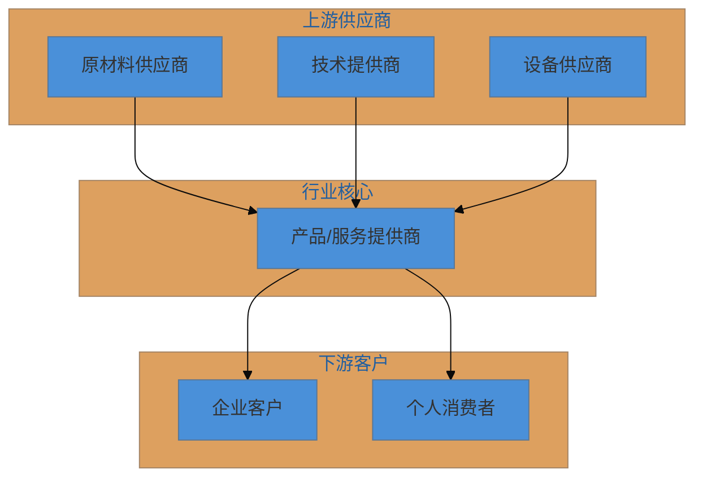
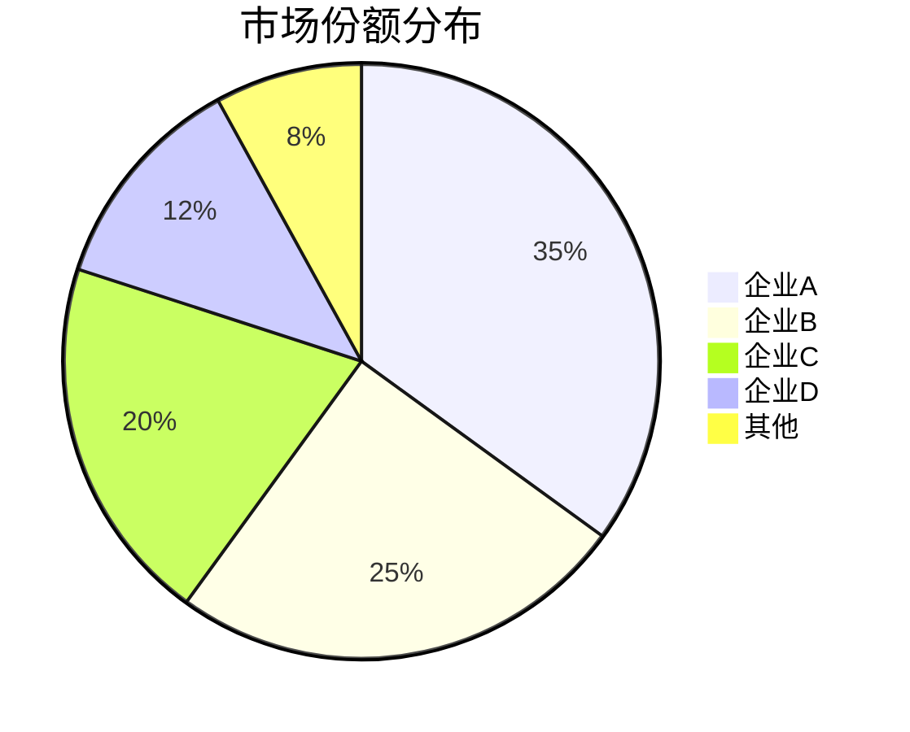
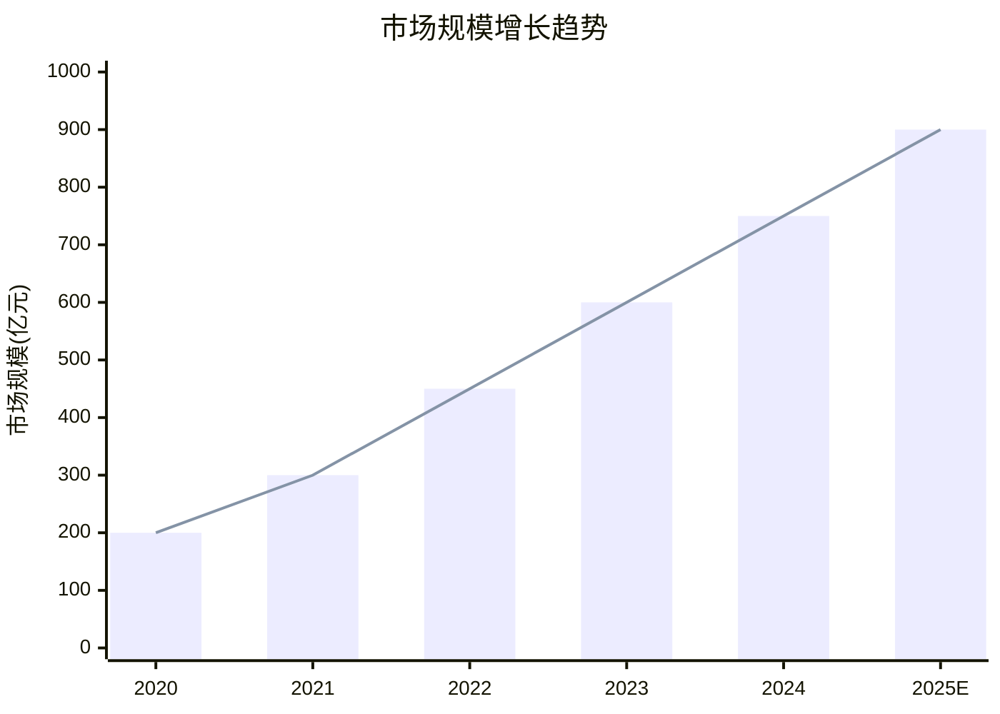

# 行业分析报告模板

本文档提供行业分析报告的标准模板和写作指南。

## 图文并茂原则

为保证报告可读性，必须遵循以下原则：

### 图表配置要求

| 章节 | 必需图表类型 | 数量要求 |
|------|-------------|----------|
| 行业概览 | 柱状图/折线图 + 饼图 | 至少2张 |
| PEST分析 | 思维导图 | 至少1张 |
| BCG矩阵 | 象限图 | 至少1张 |
| SWOT分析 | 象限图或思维导图 | 至少1张 |
| 竞争格局 | 饼图 + 流程图 | 至少2张 |
| 总结建议 | 时间线或甘特图 | 可选 |

### 可视化增强清单

- [ ] 市场规模数据 → 柱状图展示趋势
- [ ] 增长率数据 → 折线图展示变化
- [ ] 市场份额数据 → 饼图展示占比
- [ ] 分析框架 → 思维导图或象限图
- [ ] 产业链结构 → 流程图展示关系
- [ ] 发展历程 → 时间线图展示节点

### 图表设计规范

1. **标题清晰**：每张图表必须有明确标题
2. **数据标注**：关键数据点标注数值
3. **图例完整**：多系列图表需要图例说明
4. **单位明确**：纵轴/数值需注明单位（亿元、%、万人等）
5. **来源标注**：重要数据标注来源

---

## 报告封面

```markdown
# [行业名称]行业分析报告

**报告日期**：[YYYY年MM月]
**分析周期**：[数据覆盖时间范围]
**报告版本**：V1.0

---
```

## 报告目录结构

```markdown
## 目录

一、行业概览
  1.1 行业概况
  1.2 行业基本数据
  1.3 行业痛点分析
  1.4 商业模式分析
  1.5 产业链位置

二、PEST环境分析
  2.1 政治法规环境
  2.2 经济环境
  2.3 社会文化环境
  2.4 技术环境
  2.5 PEST综合评估

三、BCG矩阵分析
  3.1 市场定位分析
  3.2 各象限企业/业务
  3.3 战略建议

四、SWOT战略分析
  4.1 优势分析
  4.2 劣势分析
  4.3 机会分析
  4.4 威胁分析
  4.5 交叉策略分析

五、竞争格局分析
  5.1 主要竞争者
  5.2 竞争态势
  5.3 竞争趋势

六、总结与建议
  6.1 关键洞察
  6.2 战略建议
  6.3 风险提示

附录
  数据来源
  术语解释
```

---

## 一、行业概览

### 1.1 行业概况

```markdown
### 1.1 行业概况

#### 行业定义
[行业名称]是指[行业定义描述]，主要包括[细分领域列举]。

#### 行业边界
- **上游边界**：[与上游行业的界定]
- **下游边界**：[与下游行业的界定]
- **横向边界**：[与相关行业的界定]

#### 发展历程

| 阶段 | 时间 | 特征 |
|------|------|------|
| 萌芽期 | [时间] | [特征描述] |
| 成长期 | [时间] | [特征描述] |
| 成熟期 | [时间] | [特征描述] |

#### 当前发展阶段
[描述行业当前所处的发展阶段及主要特征]

#### 核心特征
1. [特征1]
2. [特征2]
3. [特征3]
```

### 1.2 行业基本数据

```markdown
### 1.2 行业基本数据

#### 市场规模

| 指标 | 数值 | 数据来源 |
|------|------|----------|
| 全球市场规模 | [X亿美元] | [来源] |
| 中国市场规模 | [X亿元] | [来源] |
| 同比增长率 | [X%] | [来源] |
| 预测CAGR | [X%] | [来源] |

#### 市场规模趋势图

[插入mermaid图表]

#### 细分市场占比

| 细分市场 | 市场规模 | 占比 |
|----------|----------|------|
| [细分1] | [X亿元] | [X%] |
| [细分2] | [X亿元] | [X%] |
| [细分3] | [X亿元] | [X%] |

#### 区域分布

| 区域 | 市场规模 | 占比 |
|------|----------|------|
| [区域1] | [X亿元] | [X%] |
| [区域2] | [X亿元] | [X%] |
| [区域3] | [X亿元] | [X%] |
```

### 1.3 行业痛点分析

```markdown
### 1.3 行业痛点分析

#### 技术层面痛点
1. **[痛点名称]**
   - 问题描述：[具体描述]
   - 影响范围：[影响分析]
   - 解决方向：[可能的解决思路]

#### 商业层面痛点
1. **[痛点名称]**
   - 问题描述：[具体描述]
   - 影响范围：[影响分析]
   - 解决方向：[可能的解决思路]

#### 用户层面痛点
1. **[痛点名称]**
   - 问题描述：[具体描述]
   - 影响范围：[影响分析]
   - 解决方向：[可能的解决思路]

#### 监管层面痛点
1. **[痛点名称]**
   - 问题描述：[具体描述]
   - 影响范围：[影响分析]
   - 解决方向：[可能的解决思路]

#### 痛点优先级矩阵

| 痛点 | 紧迫性 | 影响度 | 优先级 |
|------|--------|--------|--------|
| [痛点1] | 高/中/低 | 高/中/低 | P0/P1/P2 |
| [痛点2] | 高/中/低 | 高/中/低 | P0/P1/P2 |
```

### 1.4 商业模式分析

```markdown
### 1.4 商业模式分析

#### 主流商业模式

| 模式类型 | 代表企业 | 特点 |
|----------|----------|------|
| [模式1] | [企业] | [特点描述] |
| [模式2] | [企业] | [特点描述] |
| [模式3] | [企业] | [特点描述] |

#### 盈利模式分析

| 收入来源 | 占比 | 特点 |
|----------|------|------|
| [收入1] | [X%] | [描述] |
| [收入2] | [X%] | [描述] |
| [收入3] | [X%] | [描述] |

#### 价值链分析

[插入mermaid流程图展示价值链]

#### 成本结构分析

| 成本项 | 占比 | 趋势 |
|--------|------|------|
| [成本1] | [X%] | 上升/下降/稳定 |
| [成本2] | [X%] | 上升/下降/稳定 |
| [成本3] | [X%] | 上升/下降/稳定 |
```

### 1.5 产业链位置

```markdown
### 1.5 产业链位置

#### 产业链全景图

[插入mermaid流程图]

#### 上游供应商分析

| 供应商类型 | 主要企业 | 议价能力 |
|------------|----------|----------|
| [类型1] | [企业列表] | 强/中/弱 |
| [类型2] | [企业列表] | 强/中/弱 |

#### 下游客户分析

| 客户类型 | 需求特点 | 议价能力 |
|----------|----------|----------|
| [类型1] | [特点描述] | 强/中/弱 |
| [类型2] | [特点描述] | 强/中/弱 |

#### 产业链价值分布

| 环节 | 价值占比 | 利润率 |
|------|----------|--------|
| 上游 | [X%] | [X%] |
| 中游 | [X%] | [X%] |
| 下游 | [X%] | [X%] |

#### 关键环节识别
[分析产业链中的关键环节及其重要性]
```

---

## 二、PEST环境分析

```markdown
## 二、PEST环境分析

### 2.1 政治法规环境

#### 主要政策法规

| 政策名称 | 发布时间 | 核心内容 | 影响分析 |
|----------|----------|----------|----------|
| [政策1] | [时间] | [内容] | [影响] |
| [政策2] | [时间] | [内容] | [影响] |

#### 监管趋势
[分析监管趋势]

#### 政策影响评估
- **利好因素**：[列举]
- **风险因素**：[列举]

### 2.2 经济环境

#### 宏观经济指标

| 指标 | 数值 | 趋势 |
|------|------|------|
| GDP增长率 | [X%] | [趋势] |
| 居民可支配收入 | [X元] | [趋势] |
| 消费支出增长 | [X%] | [趋势] |

#### 消费市场分析
[分析消费能力和消费结构变化]

#### 行业投融资情况
[分析资本市场对行业的态度]

### 2.3 社会文化环境

#### 人口结构变化
[分析人口结构对行业的影响]

#### 消费观念演变
[分析消费观念变化趋势]

#### 生活方式影响
[分析生活方式变化对行业的影响]

### 2.4 技术环境

#### 核心技术发展
[分析关键技术进展]

#### 数字化转型
[分析数字化对行业的影响]

#### 新兴技术应用
[分析AI、大数据等技术的应用]

### 2.5 PEST综合评估

| 维度 | 机会 | 威胁 | 影响程度 |
|------|------|------|----------|
| Political | [机会点] | [威胁点] | 高/中/低 |
| Economic | [机会点] | [威胁点] | 高/中/低 |
| Social | [机会点] | [威胁点] | 高/中/低 |
| Technological | [机会点] | [威胁点] | 高/中/低 |

[插入PEST分析mermaid图表]
```

---

## 三、BCG矩阵分析

```markdown
## 三、BCG矩阵分析

### 3.1 市场定位分析

#### 分析维度说明
- **市场增长率**：[定义和计算方法]
- **相对市场份额**：[定义和计算方法]

#### 数据基础

| 分析对象 | 市场增长率 | 相对市场份额 | 象限定位 |
|----------|------------|--------------|----------|
| [对象1] | [X%] | [X.X] | [象限] |
| [对象2] | [X%] | [X.X] | [象限] |
| [对象3] | [X%] | [X.X] | [象限] |

### 3.2 各象限企业/业务

#### 明星业务 (Stars)
- **[企业/业务名称]**
  - 市场地位：[描述]
  - 增长表现：[描述]
  - 发展策略：[建议]

#### 现金牛业务 (Cash Cows)
- **[企业/业务名称]**
  - 市场地位：[描述]
  - 盈利能力：[描述]
  - 发展策略：[建议]

#### 问题业务 (Question Marks)
- **[企业/业务名称]**
  - 市场地位：[描述]
  - 发展潜力：[描述]
  - 发展策略：[建议]

#### 瘦狗业务 (Dogs)
- **[企业/业务名称]**
  - 市场地位：[描述]
  - 困境分析：[描述]
  - 发展策略：[建议]

### 3.3 战略建议

[插入BCG矩阵mermaid图表]

[基于BCG矩阵的整体战略建议]
```

---

## 四、SWOT战略分析

```markdown
## 四、SWOT战略分析

### 4.1 优势分析 (Strengths)

| 优势类型 | 具体表现 | 重要程度 |
|----------|----------|----------|
| 技术优势 | [描述] | 高/中/低 |
| 资源优势 | [描述] | 高/中/低 |
| 运营优势 | [描述] | 高/中/低 |
| 市场优势 | [描述] | 高/中/低 |

### 4.2 劣势分析 (Weaknesses)

| 劣势类型 | 具体表现 | 影响程度 |
|----------|----------|----------|
| 技术短板 | [描述] | 高/中/低 |
| 资源限制 | [描述] | 高/中/低 |
| 运营问题 | [描述] | 高/中/低 |
| 市场弱点 | [描述] | 高/中/低 |

### 4.3 机会分析 (Opportunities)

| 机会类型 | 具体表现 | 把握难度 |
|----------|----------|----------|
| 市场机会 | [描述] | 高/中/低 |
| 政策机会 | [描述] | 高/中/低 |
| 技术机会 | [描述] | 高/中/低 |
| 竞争机会 | [描述] | 高/中/低 |

### 4.4 威胁分析 (Threats)

| 威胁类型 | 具体表现 | 威胁程度 |
|----------|----------|----------|
| 竞争威胁 | [描述] | 高/中/低 |
| 政策风险 | [描述] | 高/中/低 |
| 技术风险 | [描述] | 高/中/低 |
| 市场风险 | [描述] | 高/中/低 |

### 4.5 交叉策略分析

#### 优势-机会 (SO) 策略
- [策略1]：利用[优势]抓住[机会]
- [策略2]：利用[优势]抓住[机会]
- **综合建议**：[一句话总结]

#### 劣势-机会 (WO) 策略
- [策略1]：通过[机会]弥补[劣势]
- [策略2]：通过[机会]弥补[劣势]
- **综合建议**：[一句话总结]

#### 优势-威胁 (ST) 策略
- [策略1]：利用[优势]应对[威胁]
- [策略2]：利用[优势]应对[威胁]
- **综合建议**：[一句话总结]

#### 劣势-威胁 (WT) 策略
- [策略1]：减少[劣势]避免[威胁]
- [策略2]：减少[劣势]避免[威胁]
- **综合建议**：[一句话总结]

[插入SWOT分析mermaid图表]
```

---

## 五、竞争格局分析

```markdown
## 五、竞争格局分析

### 5.1 主要竞争者

| 企业名称 | 市场份额 | 核心优势 | 主要产品/服务 |
|----------|----------|----------|---------------|
| [企业1] | [X%] | [优势] | [产品] |
| [企业2] | [X%] | [优势] | [产品] |
| [企业3] | [X%] | [优势] | [产品] |

### 5.2 竞争态势

#### 竞争格局特征
[描述当前竞争格局的主要特征]

#### 竞争强度评估
[评估行业竞争强度]

#### 竞争策略分析

| 企业 | 竞争策略 | 策略效果 |
|------|----------|----------|
| [企业1] | [策略描述] | [效果评估] |
| [企业2] | [策略描述] | [效果评估] |

### 5.3 竞争趋势

[分析未来竞争格局的演变趋势]

[插入竞争格局mermaid图表]
```

---

## 六、总结与建议

```markdown
## 六、总结与建议

### 6.1 关键洞察

#### 洞察一：[标题]
[详细描述]

#### 洞察二：[标题]
[详细描述]

#### 洞察三：[标题]
[详细描述]

#### 洞察四：[标题]
[详细描述]

### 6.2 战略建议

#### 短期建议（1年内）
1. [建议1]
2. [建议2]
3. [建议3]

#### 中期建议（1-3年）
1. [建议1]
2. [建议2]
3. [建议3]

#### 长期建议（3年以上）
1. [建议1]
2. [建议2]
3. [建议3]

### 6.3 风险提示

| 风险类型 | 风险描述 | 发生概率 | 影响程度 | 应对措施 |
|----------|----------|----------|----------|----------|
| [风险1] | [描述] | 高/中/低 | 高/中/低 | [措施] |
| [风险2] | [描述] | 高/中/低 | 高/中/低 | [措施] |
| [风险3] | [描述] | 高/中/低 | 高/中/低 | [措施] |
```

---

## 附录

```markdown
## 附录

### 数据来源

| 数据类型 | 来源 | 获取时间 |
|----------|------|----------|
| 市场规模数据 | [来源] | [时间] |
| 企业数据 | [来源] | [时间] |
| 政策数据 | [来源] | [时间] |

### 术语解释

| 术语 | 解释 |
|------|------|
| [术语1] | [解释] |
| [术语2] | [解释] |
| [术语3] | [解释] |

### 免责声明

本报告基于公开信息和数据分析编制，仅供参考。报告中的观点和结论不构成任何投资建议。
```

---

## Mermaid图表示例

### 产业链图示例



### 市场份额饼图示例



### 增长趋势图示例


